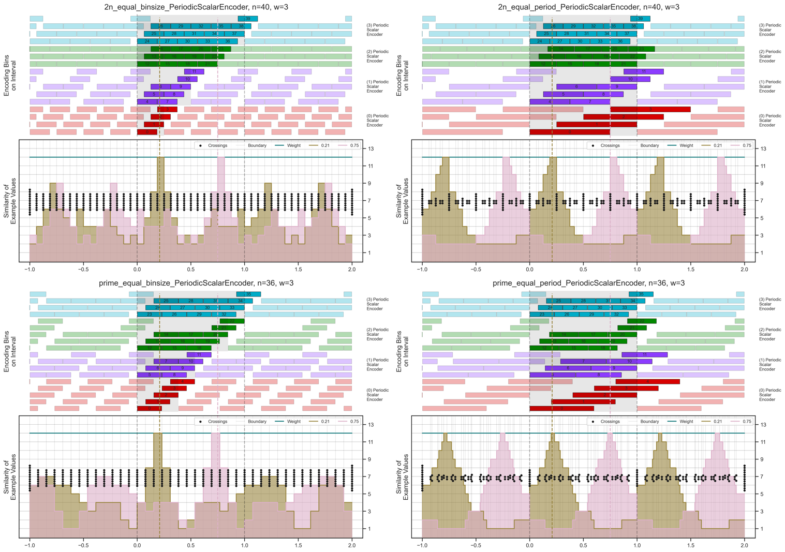
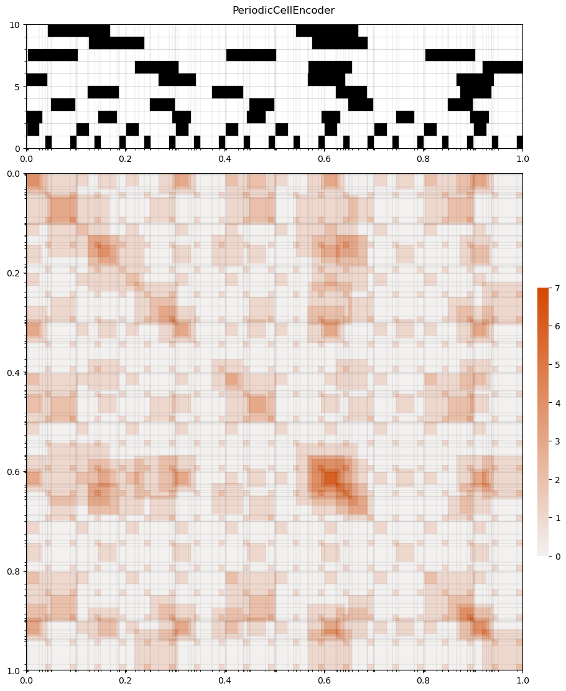
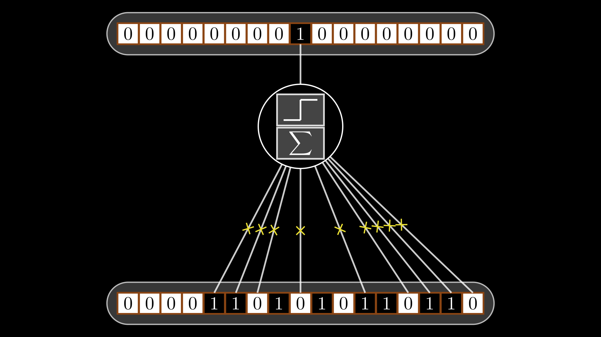
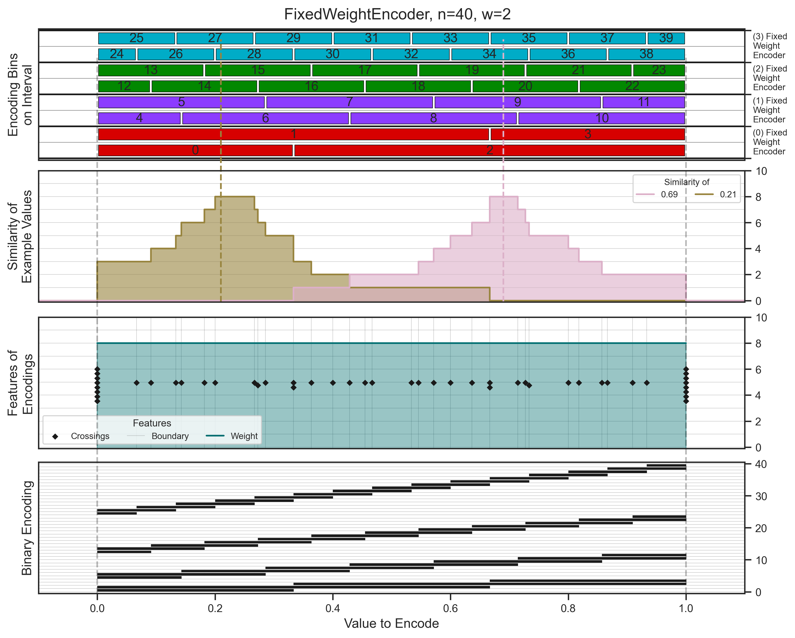
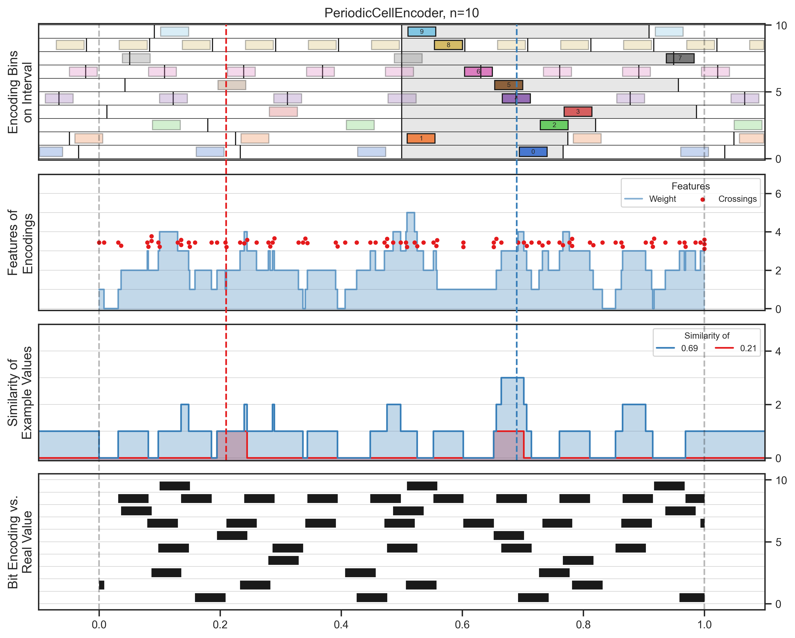

# Gnome Visuals

Visualization toolkit for Gnome Codes - scalar encoding using binary population codes.

This is a modernization and migration from the
original [legacy visual gallery](https://github.com/jacobeverist/legacy_gnome_gallery)
and [visualization code](https://github.com/jacobeverist/legacy_gnome_visuals) repositories.

This toolkit mostly makes use of the [gnomecode](https://github.com/jacobeverist/gnomecode) package which implements
detailed control of encoders and analysis of their properties. The visualization code provided here illustrates all of
that information in interesting and insightful ways.

## Overview

This repository provides comprehensive visualization tools across three main technologies:

- **Manim**: Animated educational content about encoder behavior
- **Matplotlib**: Static plots and quantitative analysis
- **Dash/Plotly**: Interactive web-based exploration

## Gallery

<table>
<tr>
  <td align="center">
    <a href="gallery/animation_examples/">
        <br/>
        <b>Gnome bins shuffled and reordered</b>
    </a>
  </td>
  <td align="center">
    <a href="gallery/periodic_scalar_encoder_examples/">
    <br/>
    <b>Periodic scalar encoder features (w=3)</b>
    </a>
  </td>
  <td align="center">
    <a href="gallery/plot_examples/">
    <br/>
    <b>Periodic cell encoder similarity matrix</b>
    </a>
  </td>
</tr>
<tr>
  <td align="center">
    <a href="gallery/manim_examples/">
    <br/>
    <b>Discrete population neural network</b>
    </a>
  </td>
  <td align="center">
    <a href="gallery/fixed_weight_encoder_examples/">
    <br/>
    <b>Fixed weight encoder features (n=40, w=2)</b>
    </a>
  </td>
  <td align="center">
    <a href="gallery/samples/">
    <br/>
    <b>Periodic cell encoder (n=10)</b>
    </a>
  </td>
</tr>
</table>

Browse the full [gallery/](gallery/) for all examples.

## Installation

### Prerequisites

This package requires Python 3.8 or later and depends on the
separate [gnomecode](https://github.com/jacobeverist/gnomecode) package.

### Standard Installation

```bash
# Install gnomevisual in editable mode
pip install -e .

# If you're also developing the gnomecode package, install it in editable mode
pip install -e /path/to/gnomecode
```

### Development Installation

For development work with additional tools (testing, linting, profiling):

```bash
# Install with dev dependencies
pip install -e ".[dev]"

# Install gnomecode in editable mode for active development
pip install -e /path/to/gnomecode
```

### Verify Installation

```bash
# Test imports
python -c "from gnomevisual.matplotlib import draw_multi_encoder_bins; print('Success!')"
python -c "from gnomevisual.manim import GnomeCode; print('Success!')"
```

## Quick Start

### Manim Animations

Create animated visualizations of encoder behavior:

```bash
# Run an experiment
manim experiments/encoder_basics/manim/render_bins.py

# Run a specific scene
manim experiments/encoder_basics/manim/encoder_folded.py EncoderFoldScene

# Start from a template
cp examples/templates/manim_template.py experiments/encoder_basics/manim/my_animation.py
manim experiments/encoder_basics/manim/my_animation.py MyScene
```

Output videos are saved to `media/` or `outputs/videos/`.

### Matplotlib Plots

Generate static plots for analysis:

```bash
# Run the main plotting script
python scripts/plot_encoders.py

# Start from a template
cp examples/templates/matplotlib_template.py my_analysis.py
python my_analysis.py
```

Output images are saved to `outputs/figures/`.

### Dash Interactive Apps

Launch interactive web applications:

```bash
# Launch the encoder dashboard
cd apps/dash_encoder
python run_app.py

# Open browser to http://localhost:8050

# Custom port
python run_app.py --port 8080 --debug
```

## Repository Structure

```
gnome_visuals/
├── gnomevisual/          # Core reusable package
│   ├── matplotlib/       # Matplotlib components (axesplots, layouts)
│   ├── manim/           # Manim components (GnomeCode, Synapse, etc.)
│   ├── plotly/          # Plotly/Dash components (early stage)
│   └── utils.py         # General utilities
├── experiments/          # Topic-organized experiments
│   ├── encoder_basics/
│   ├── neural_networks/
│   ├── hypergrid_transform/
│   ├── discrete_neurons/
│   ├── similarity_analysis/  # placeholder, no experiments yet
│   └── parameter_sweeps/     # placeholder, no experiments yet
├── apps/                # Standalone applications
│   └── dash_encoder/
├── gallery/             # Example output images and animations
├── publications/        # Publication-specific projects
├── scripts/            # Utility scripts
├── examples/           # Templates
└── outputs/            # Generated content (gitignored)
```

See [CLAUDE.md](CLAUDE.md) for detailed architecture documentation.

## Usage Examples

### Using gnomevisual in Scripts

```python
# Matplotlib visualization
from gnomecode.encoders import PeriodicScalarEncoder
from gnomevisual.matplotlib import draw_multi_encoder_bins, plot_code_heatmap
import matplotlib.pyplot as plt

encoder = PeriodicScalarEncoder(n=32, w=8, period=1.0)
fig, ax = plt.subplots()
draw_multi_encoder_bins(ax, encoder)
plt.show()

# Manim animation
from manim import *
from gnomevisual.manim import GnomeCode


class MyScene(Scene):
    def construct(self):
        gnome = GnomeCode(n=32, w=8, shape="square")
        self.play(Create(gnome))
```

### Organizing Experiments

Experiments are organized by research topic, with subdirectories for each technology:

```bash
# Add a new encoder visualization
cp examples/templates/manim_template.py experiments/encoder_basics/manim/my_experiment.py

# Edit and run
manim experiments/encoder_basics/manim/my_experiment.py
```

## Development

### Running Tests

```bash
# Run all tests
pytest

# Run with coverage
pytest --cov=gnomevisual --cov-report=html
```

### Code Formatting

```bash
# Format code with black
black gnomevisual/

# Sort imports with isort
isort gnomevisual/

# Check style with flake8
flake8 gnomevisual/
```

### Profiling

```bash
# Profile a script
python -m line_profiler_pycharm script.py
```

## Documentation

- **[CLAUDE.md](CLAUDE.md)**: Comprehensive architecture and development guide
- **[experiments/README.md](experiments/README.md)**: Guide to experiments organization
- **Topic READMEs**: Each experiment topic has its own README explaining research questions

## Contributing

1. Follow the existing code structure
2. Use templates from `examples/templates/` for consistency
3. Import from `gnomevisual` submodules (e.g., `from gnomevisual.manim import GnomeCode`)
4. Place generated outputs in `outputs/` directory
5. Run tests and formatters before committing

## License

MIT License - see LICENSE file for details.

## Citation

If you use this visualization toolkit in your research, please cite:

```bibtex
@software{gnome_visuals,
    author = {Everist, Jacob},
    title = {Gnome Visuals: Visualization Toolkit for Gnome Codes},
    year = {2024},
    url = {https://github.com/jacobeverist/gnome_visuals}
}
```
