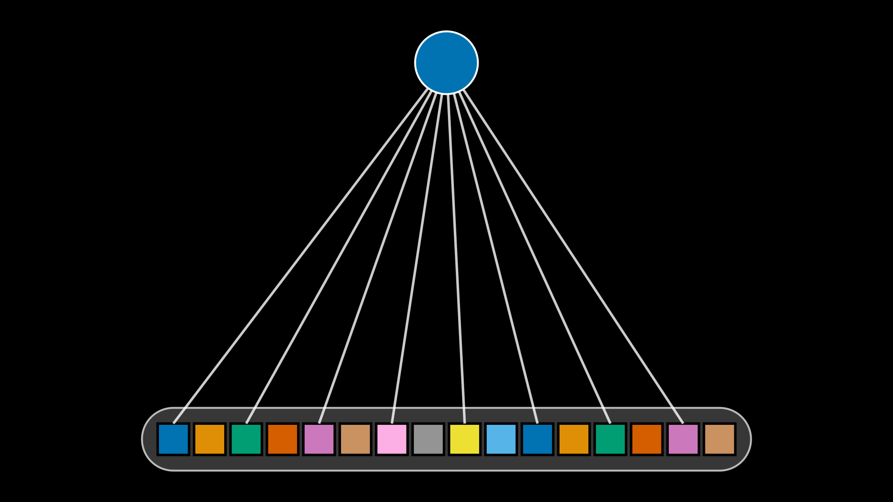
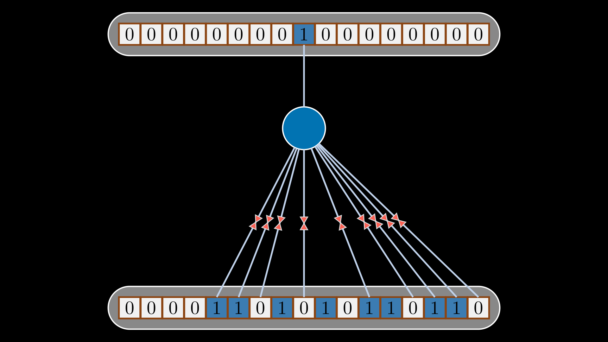
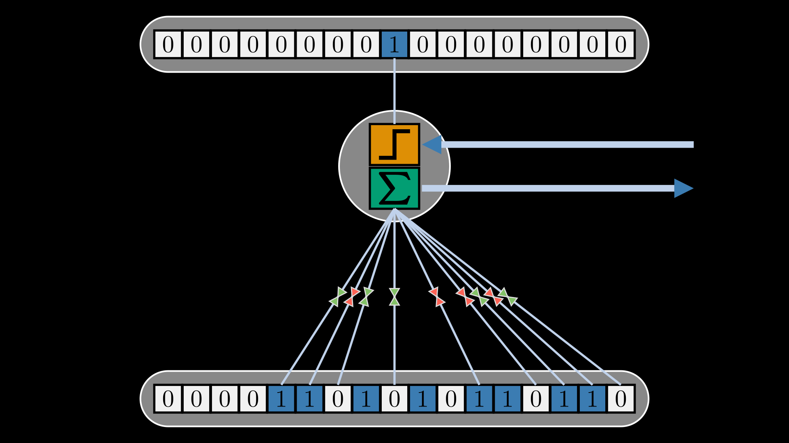
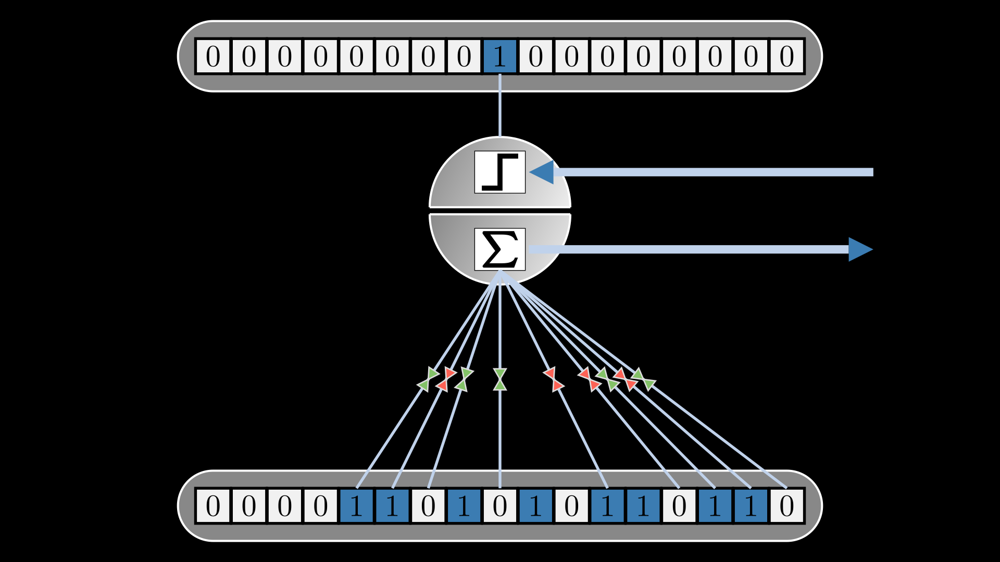

# DPNN Structure — Development Progression

Five-stage iterative development of the Discrete Population Neural Network (DPNN) structure visualization, rendered with Manim CE v0.17.2.

Each stage adds a new structural element on top of the previous.

---

<table>
<tr>
  <td align="center">
     
    <b>Stage 1 — NaiveNeuronScene</b> 
    Simple baseline neuron representation
  </td>
  <td align="center">
     
    <b>Stage 2 — DiscreteSynapseScene</b> 
    Discrete synapse added
  </td>
  <td align="center">
     
    <b>Stage 3 — DiscreteOperationsScene</b> 
    Discrete operations layer
  </td>
</tr>
<tr>
  <td align="center">
     
    <b>Stage 4 — SynapticBusScene</b> 
    Synaptic bus connecting encoder to neurons
  </td>
  <td align="center">
     
    <b>Stage 5 — WindowedNetworkScene</b> 
    Full windowed network with all components
  </td>
  <td></td>
</tr>
</table>
