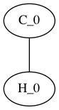
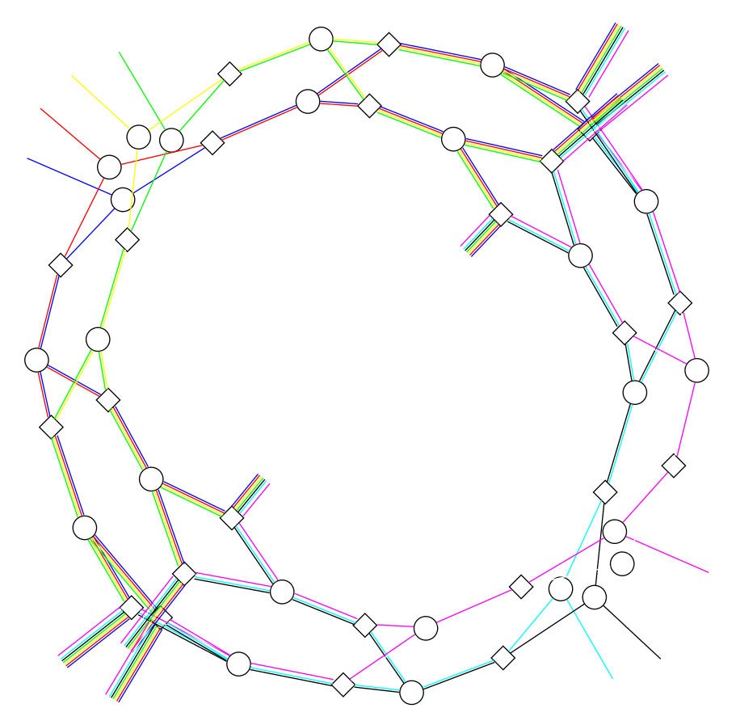
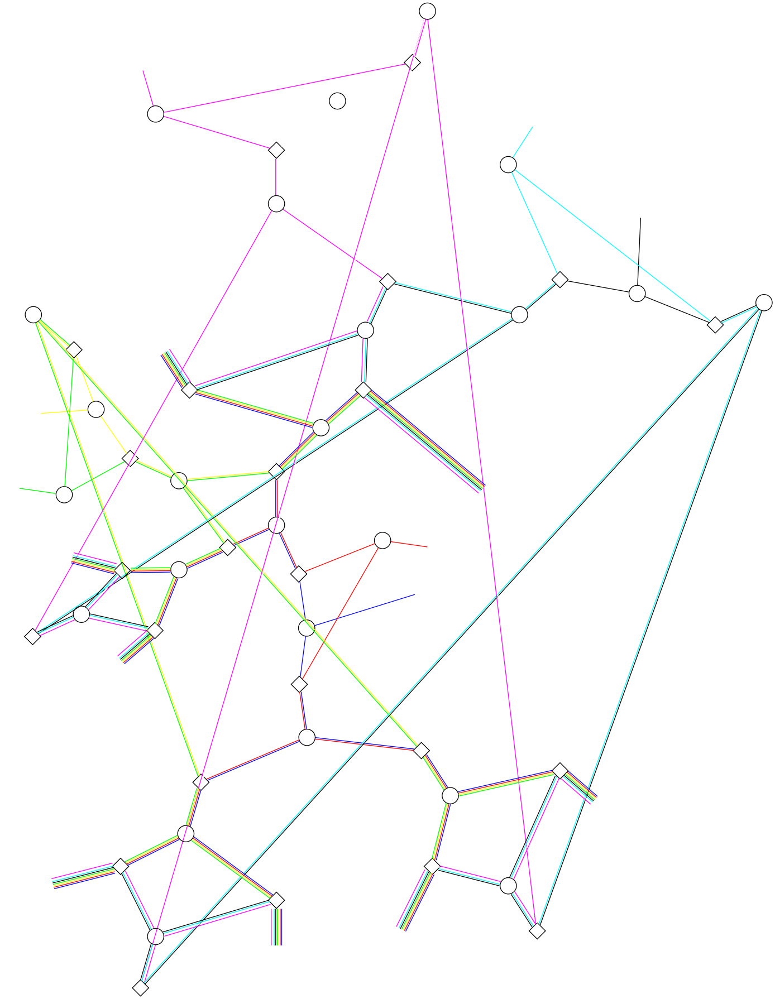
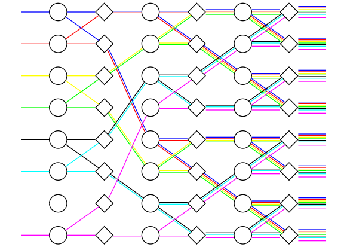

# Graphviz Experiments

Exploratory graph layout renders using Graphviz. These were early experiments with graph-based visualization approaches.

<table>
<tr>
  <td align="center">
     
    <b>EthaneTest</b> 
    Ethane molecule test render
  </td>
  <td align="center">
     
    <b>graph</b> 
    Basic graph structure diagram
  </td>
</tr>
<tr>
  <td align="center">
     
    <b>graph2</b> 
    Graph structure variant 2
  </td>
  <td align="center">
     
    <b>graph3</b> 
    Graph structure variant 3
  </td>
</tr>
</table>
