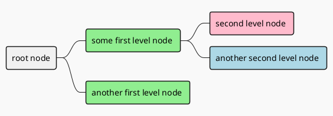
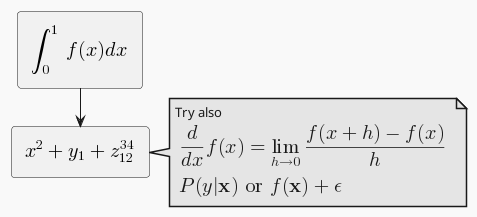
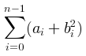
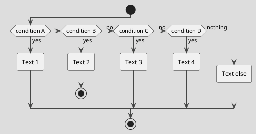
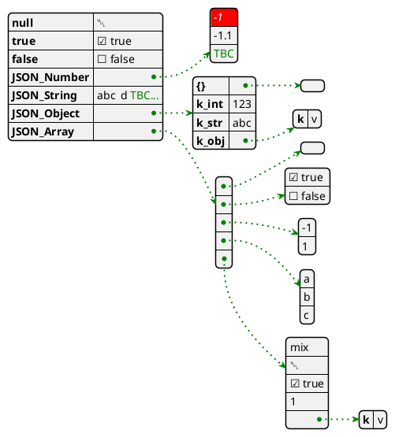
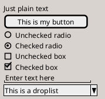
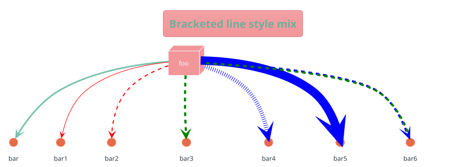

```plantuml
@startmindmap
!theme mars
<style>
mindmapDiagram {
  .green {
    BackgroundColor lightgreen
  }
  .rose {
    BackgroundColor #FFBBCC
  }
  .your_style_name {
    BackgroundColor lightblue
  }
}
</style>
* root node
 * some first level node <<green>>
  * second level node <<rose>>
  * another second level node <<your_style_name>>
 * another first level node <<green>>
@endmindmap

```

```plantuml
@startuml
!theme mars
:<latex>\int_0^1f(x)dx</latex>;
:<latex>x^2+y_1+z_{12}^{34}</latex>;
note right
Try also
<latex>\dfrac{d}{dx}f(x)=\lim\limits_{h \to 0}\dfrac{f(x+h)-f(x)}{h}</latex>
<latex>P(y|\mathbf{x}) \mbox{ or } f(\mathbf{x})+\epsilon</latex>
end note
@enduml
```

```plantuml
@startlatex
\sum_{i=0}^{n-1} (a_i + b_i^2)
@endlatex
```

```plantuml
@startuml
' !theme cerulean
' !theme minty
' !theme sketchy
!theme toy
start
if (condition A) then (yes)
  :Text 1;
elseif (condition B) then (yes)
  :Text 2;
  stop
(no) elseif (condition C) then (yes)
  :Text 3;
(no) elseif (condition D) then (yes)
  :Text 4;
else (nothing)
  :Text else;
endif
stop
@enduml
```

```plantuml
@startjson
<style>
jsonDiagram {
  arrow {
    BackGroundColor lightblue
    LineColor green
    LineThickness 2
    LineStyle 2-5
  }
  highlight {
    BackGroundColor red
    FontColor white
    FontStyle italic
  }
}
</style>
#highlight "JSON_Number" / "0"
{
"null": null,
"true": true,
"false": false,
"JSON_Number": [-1, -1.1, "<color:green>TBC"],
"JSON_String": "a\nb\rc\td <color:green>TBC...",
"JSON_Object": {
  "{}": {},
  "k_int": 123,
  "k_str": "abc",
  "k_obj": {"k": "v"}
},
"JSON_Array" : [
  [],
  [true, false],
  [-1, 1],
  ["a", "b", "c"],
  ["mix", null, true, 1, {"k": "v"}]
]
}
@endjson
```

```plantuml
@startsalt
!theme mimeograph
{
  Just plain text
  [This is my button]
  ()  Unchecked radio
  (X) Checked radio
  []  Unchecked box
  [X] Checked box
  "Enter text here   "
  ^This is a droplist^
}
@endsalt
```

```plantuml
@startuml
!theme minty
title Bracketed line style mix
node foo
foo --> bar                             : ∅
foo -[#red,thickness=1]-> bar1          : [#red,1]
foo -[#red,dashed,thickness=2]-> bar2   : [#red,dashed,2]
foo -[#green,dashed,thickness=4]-> bar3 : [#green,dashed,4]
foo -[#blue,dotted,thickness=8]-> bar4  : [blue,dotted,8]
foo -[#blue,plain,thickness=16]-> bar5  : [blue,plain,16]
foo -[#blue;#green,dashed,thickness=4]-> bar6  : [blue;green,dashed,4]
@enduml
```

