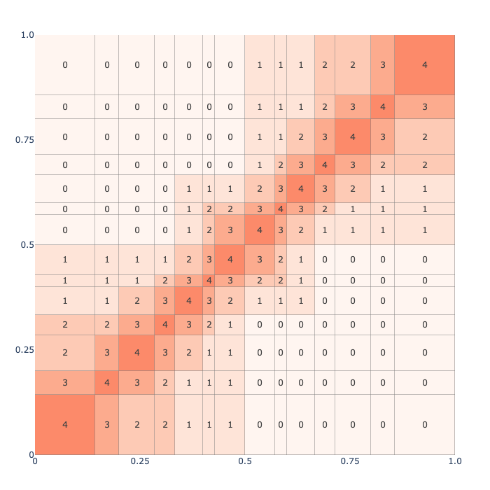

# Plotly / Dash Screenshots

Screenshot of a similarity heatmap rendered in the interactive Dash app using Plotly.

*Real-space similarity heatmap rendered interactively in the GNOME Encoder Dashboard.*
