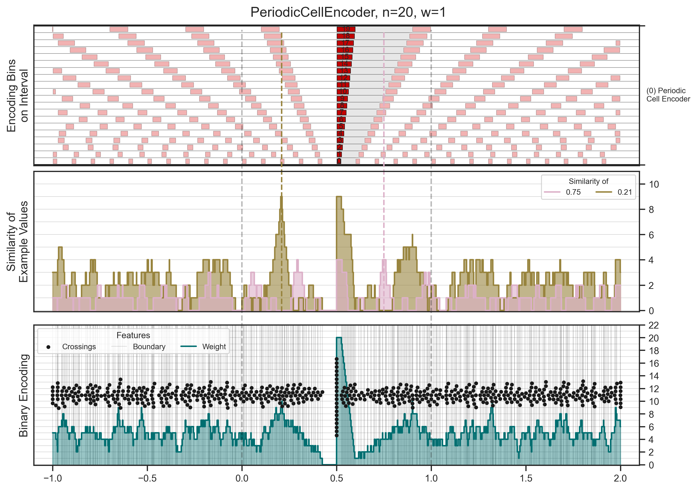
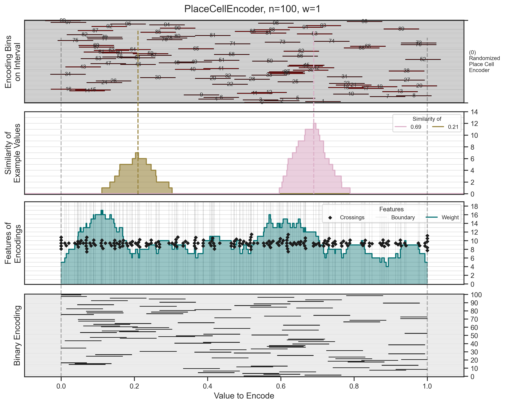
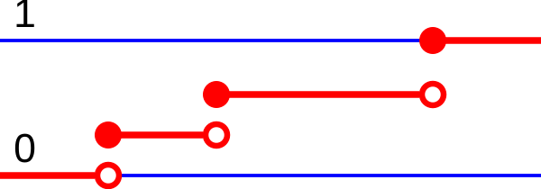

# Gallery

Visual outputs from the [Gnome Visuals](../README.md) toolkit — static plots, similarity matrices, animated sequences, and neural network diagrams.

---

## Contents

<table>
<tr>
  <td align="center" width="200">
    <a href="animation_examples/">
       
      <b>Manim Animations</b>
    </a> 
    GIF + MP4 animated sequences
  </td>
  <td align="center" width="200">
    <a href="manim_examples/">
       
      <b>Neural Network Visualizations</b>
    </a> 
    DPNN structure stills
  </td>
  <td align="center" width="200">
    <a href="periodic_scalar_encoder_examples/">
       
      <b>Periodic Scalar Encoder</b>
    </a> 
    6 style versions + prime config
  </td>
</tr>
<tr>
  <td align="center" width="200">
    <a href="periodic_cell_encoder_examples/">
       
      <b>Periodic Cell Encoder</b>
    </a> 
    Features + similarity matrix
  </td>
  <td align="center" width="200">
    <a href="place_cell_encoder_examples/">
       
      <b>Place Cell Encoder</b>
    </a> 
    100-bin place cell encoder
  </td>
  <td align="center" width="200">
    <a href="fixed_weight_encoder_examples/">
       
      <b>Fixed Weight Encoder</b>
    </a> 
    9 n/w parameter combinations
  </td>
</tr>
<tr>
  <td align="center" width="200">
    <a href="plot_examples/">
       
      <b>Plot Examples</b>
    </a> 
    Dev renders, layout experiments
  </td>
  <td align="center" width="200">
    <a href="samples/">
       
      <b>Parameter Sweep Samples</b>
    </a> 
    ~240 images + 4 palette subdirs
  </td>
  <td align="center" width="200">
    <a href="randomized_periodic_cells/">
       
      <b>Randomized Periodic Cells</b>
    </a> 
    Random-offset cell encoder
  </td>
</tr>
<tr>
  <td align="center" width="200">
    <a href="time_series_examples/">
       
      <b>Time Series &amp; State Vectors</b>
    </a> 
    BrainBlocks / Sparsey experiments
  </td>
  <td align="center" width="200">
     
    <b>Diagrams</b> 
    CDF intervals, neuron anatomy
  </td>
  <td></td>
</tr>
</table>

---

## Naming Convention

Most files follow the pattern `NNN_WWWW_EncoderType_VisualizationType.png`:

| Token | Meaning |
|---|---|
| `NNN` | Number of encoder bins (`n` parameter) |
| `WWWW` | Bin width or sample count |
| `EncoderType` | Encoder class (e.g. `PeriodicCellEncoder`) |
| `Features` | Encoding bin activation plot |
| `Similarity_Matrix_Projected_to_Real_Space` | Pairwise similarity heatmap, axes = input values |
| `Similarity_Matrix_by_Region_Code` | Pairwise similarity heatmap, axes = region codes |
| `_samples_` in name | Number of sample points used |

---

## All Directories

| Directory | Description | Count |
|---|---|---|
| [animation_examples/](animation_examples/) | Manim animated GIFs and MP4s | 8 |
| [manim_examples/](manim_examples/) | Neural network / encoder stills + MP4 | 8 |
| [periodic_scalar_encoder_examples/](periodic_scalar_encoder_examples/) | PeriodicScalarEncoder across 6 style versions | 41 |
| [periodic_cell_encoder_examples/](periodic_cell_encoder_examples/) | PeriodicCellEncoder feature + similarity | 2 |
| [place_cell_encoder_examples/](place_cell_encoder_examples/) | PlaceCellEncoder feature + similarity | 3 |
| [fixed_weight_encoder_examples/](fixed_weight_encoder_examples/) | FixedWeightEncoder across n/w combos | 18 |
| [plot_examples/](plot_examples/) | Development and exploratory renders | 51 |
| [samples/](samples/) | Systematic parameter sweep images | ~240 + subdirs |
| [randomized_periodic_cells/](randomized_periodic_cells/) | Random-offset periodic cell encoder | 1 |
| [time_series_examples/](time_series_examples/) | Temporal state vector visualizations | 12 |
| `discrete_cdf_intervals.svg` | Discrete CDF interval diagram | — |
| `Neuron_Cell_Body.png` | Neuron cell body reference diagram | — |

---

## Experiments (Work in Progress)

| Directory | Description |
|---|---|
| [experiments/discrete_neurons/dpnn_structure_progress_examples/](../experiments/discrete_neurons/dpnn_structure_progress_examples/) | 5-stage DPNN structure development progression |
| [experiments/graphviz/](../experiments/graphviz/) | Graphviz layout experiments |
| [experiments/plotly_dash/](../experiments/plotly_dash/) | Plotly/Dash app screenshot |
