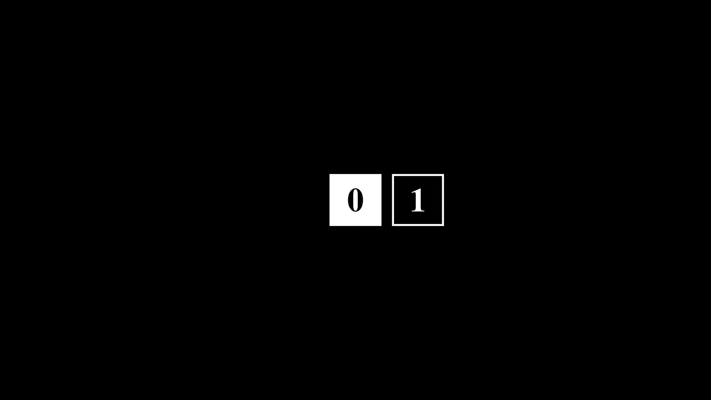
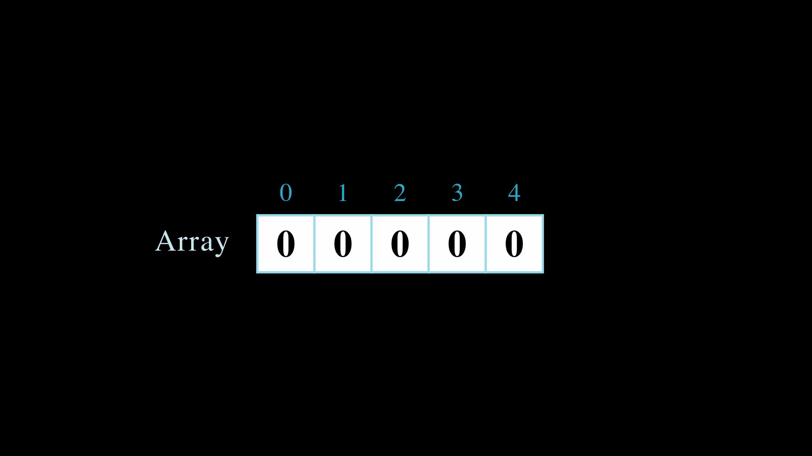

# Manim Animations

Animated sequences produced with Manim. Each scene is available as both a looping GIF (preview) and a full-quality MP4.

## Scenes

### GnomeShuffle
Bins of a gnome code shuffled and reordered in place.

[Download MP4](GnomeShuffle.mp4)

---

### SquareScene
A single gnome code rendered as a 2D square grid.

[Download MP4](SquareScene.mp4)

---

### ArrayScene
A 1D array of gnome bins arranged in a row, showing bin layout and structure.

[Download MP4](ArrayScene.mp4)

---

### SquareArrayScene
Multiple square gnome codes arranged side-by-side in a grid.

[Download MP4](SquareArrayScene.mp4)
