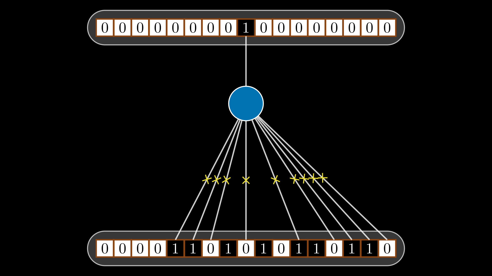
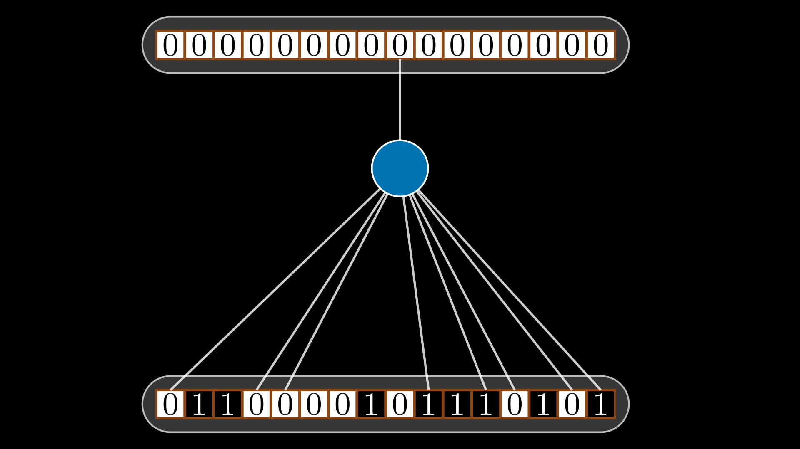
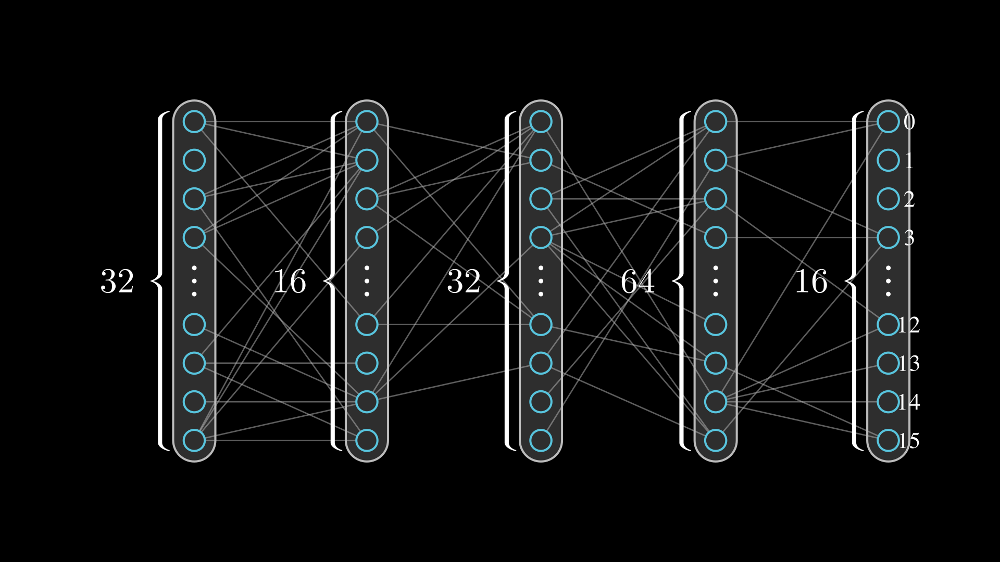
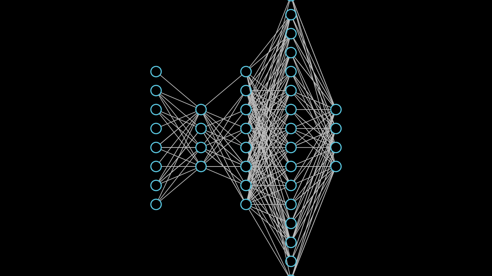

# Manim Examples — Neural Network & Encoder Visualizations

Manim-rendered stills showing gnome encoder structures and discrete population neural network (DPNN) diagrams.

For the DPNN development progression see [`experiments/discrete_neurons/dpnn_structure_progress_examples/`](../../experiments/discrete_neurons/dpnn_structure_progress_examples/).

---

## Discrete Neuron Structures

<table>
<tr>
  <td align="center">
     
    <b>NaiveNeuronScene</b> 
    Simple baseline neuron before discrete operations
  </td>
  <td align="center">
     
    <b>DiscreteSynapseScene</b> 
    Discrete synapse connecting encoder output to neuron
  </td>
  <td align="center">
     
    <b>NeuronsOperationsScene</b> 
    Multiple neurons performing discrete operations
  </td>
</tr>
</table>

---

## Encoder-to-Network Integration

<table>
<tr>
  <td align="center">
     
    <b>GnomeInputNeuronScene</b> 
    Gnome encoder feeding into a neuron layer
  </td>
  <td align="center">
     
    <b>NetworkScene v0.17.2</b> 
    Full multi-layer network with gnome encoder input
  </td>
  <td align="center">
     
    <b>NetworkScene v0.17.3</b> 
    Updated render of the full network scene
  </td>
</tr>
</table>

---

## Standalone Examples

<table>
<tr>
  <td align="center">
     
    <b>discrete_neurons_example</b> 
    Standalone discrete neuron visualization
  </td>
</tr>
</table>

---

## Video

- [Gnome_1024_bits.mp4](Gnome_1024_bits.mp4) — Large 1024-bit gnome code animation
