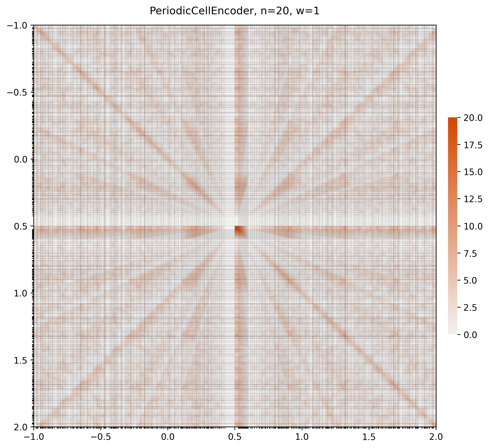

# Periodic Cell Encoder Examples

Feature plot and similarity matrix for a 20-bin periodic cell encoder (w=1).

**Parameters:** n=20, w=1

## Feature Plot

## Similarity Matrix (Projected to Real Space)

