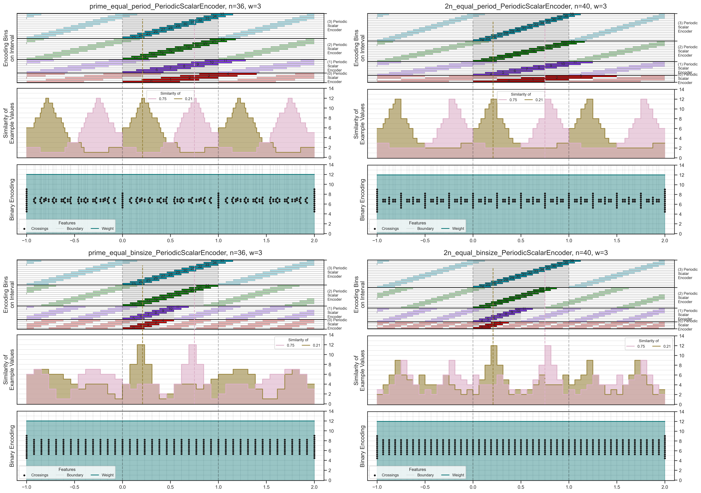
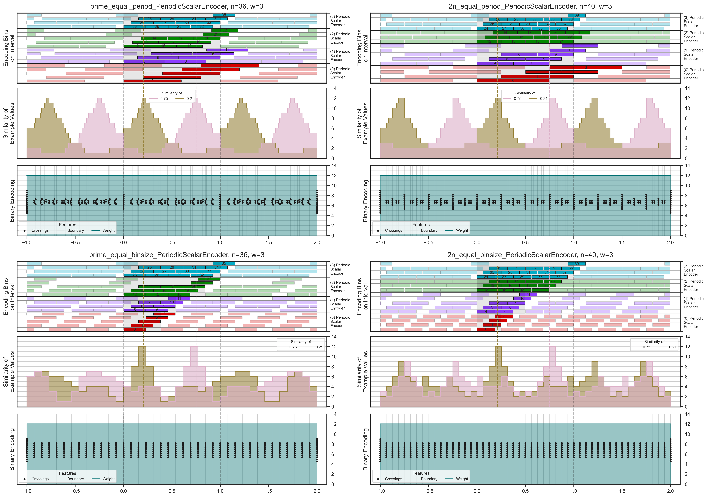
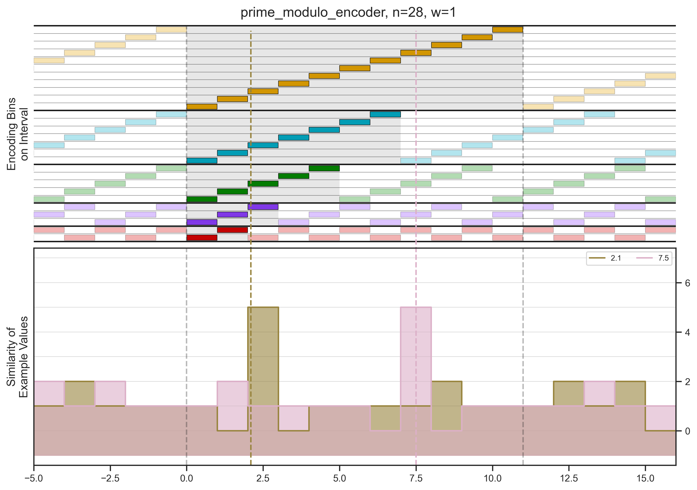
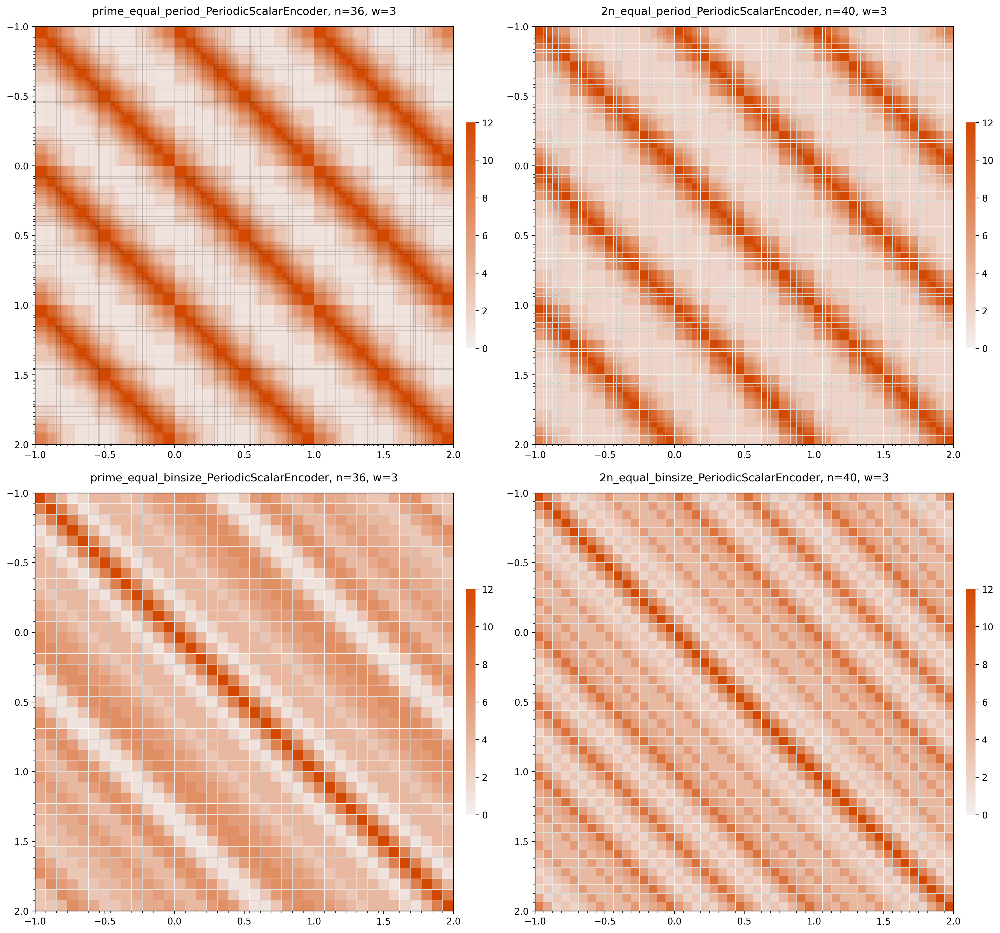

# Periodic Scalar Encoder Examples

Feature plots and similarity heatmaps for the `PeriodicScalarEncoder` across six rendering style versions (`v1`–`v6`) and a prime-integer configuration.

Each version applies the same three bin-width variants (`w=1`, `w=2`, `w=3`). Versions v4–v6 introduce a compact layout and zero-offset variants.

---

## Versions

<table>
<tr>
  <td align="center">
    <a href="v1/"> <b>v1</b> — original style</a>
  </td>
  <td align="center">
    <a href="v2/"> <b>v2</b> — style iteration 2</a>
  </td>
  <td align="center">
    <a href="v3/"> <b>v3</b> — style iteration 3</a>
  </td>
</tr>
<tr>
  <td align="center">
    <a href="v4/"> <b>v4</b> — compact layout</a>
  </td>
  <td align="center">
    <a href="v5/"> <b>v5</b> — compact style 2</a>
  </td>
  <td align="center">
    <a href="v6/"> <b>v6</b> — most polished</a>
  </td>
</tr>
</table>

---

## Prime Integer Configuration

<a href="prime_integers/">
  
   <b>prime_integers/</b> — 28-bin prime-modulo encoder
</a>

---

## Heatmap Comparison (v1 vs v6, w=3)

| v1 Similarity Heatmap | v6 Heatmap |
|---|---|
|  |  |
