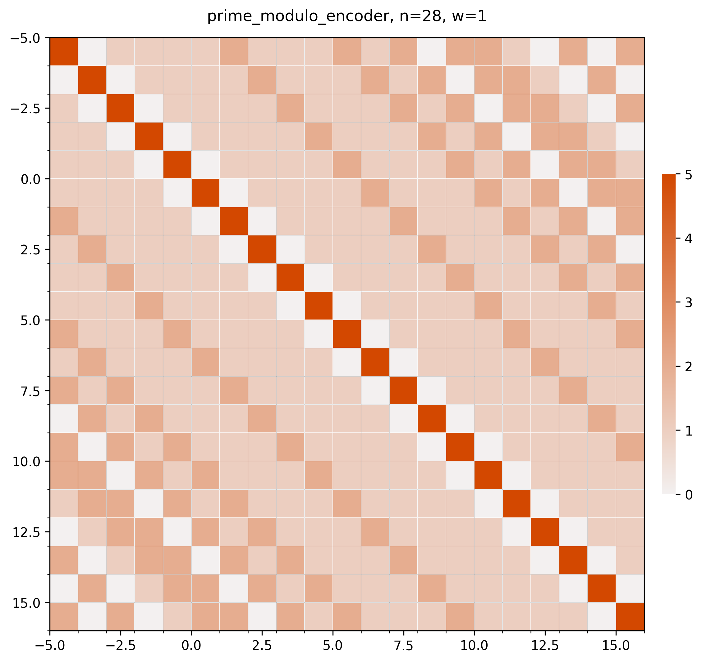

# Periodic Scalar Encoder — Prime Integer Configuration

Feature plot and similarity matrix for a 28-bin prime-modulo encoder (w=1).

**Parameters:** n=28, w=1, prime modulo encoding

## Feature Plot

## Similarity Matrix (Projected to Real Space)

