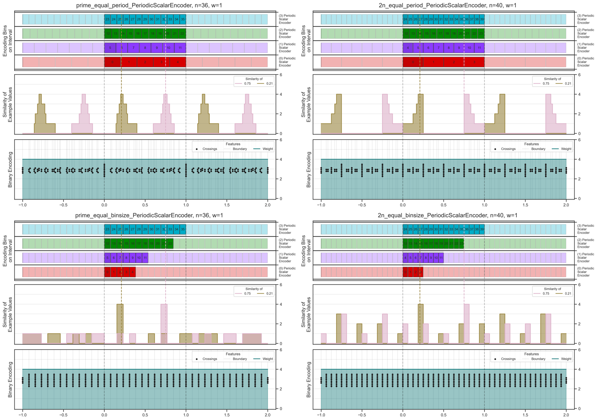
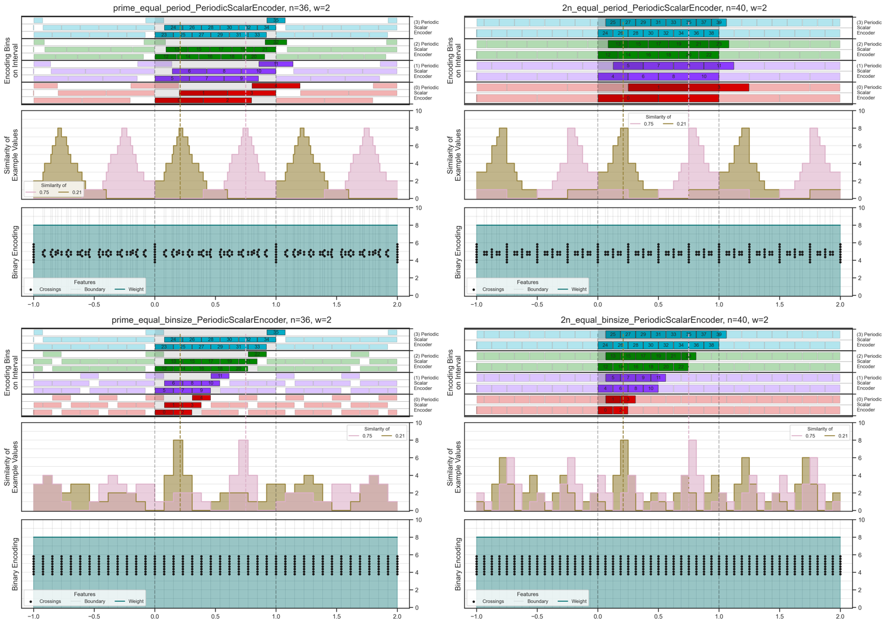
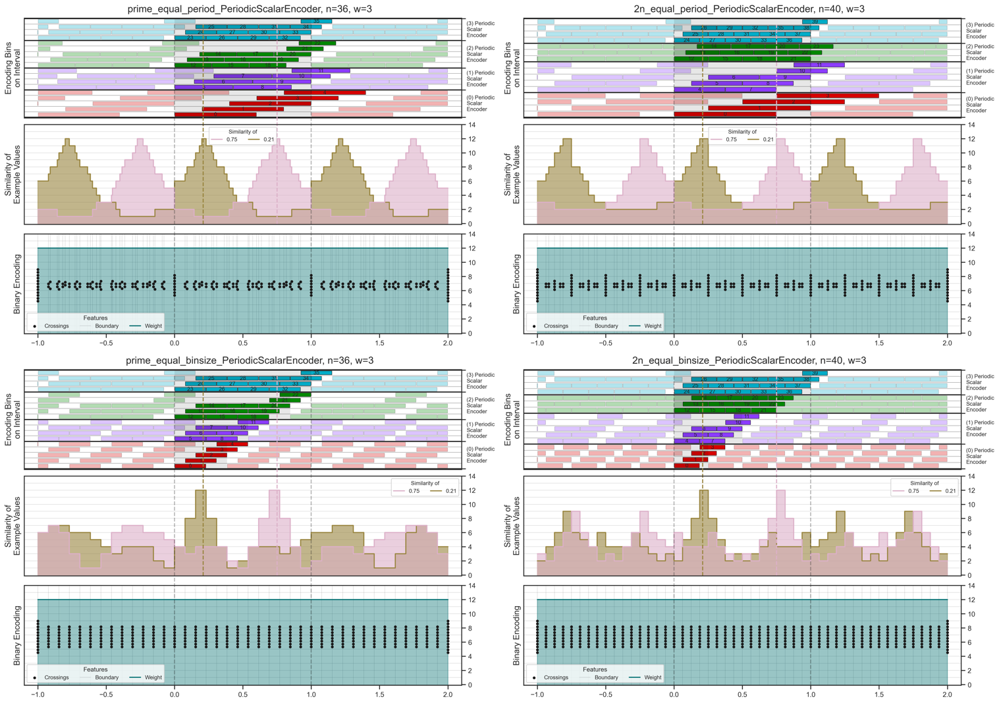
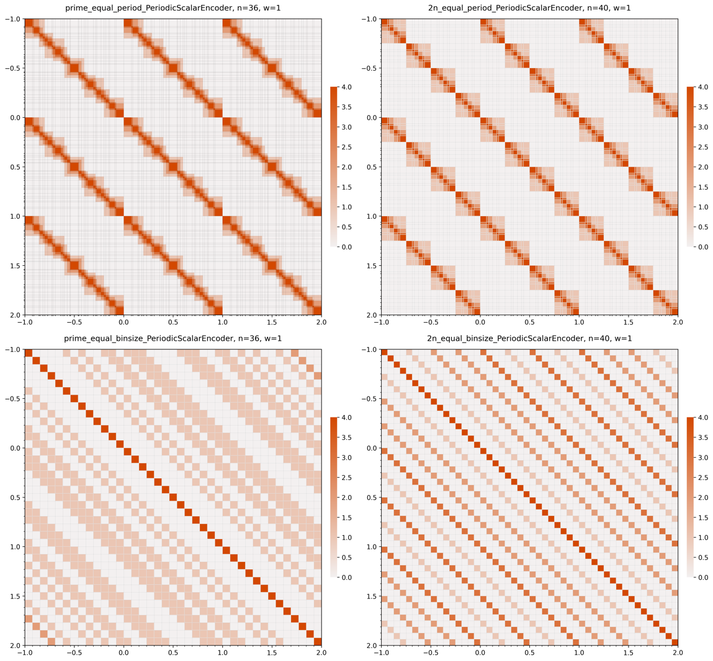
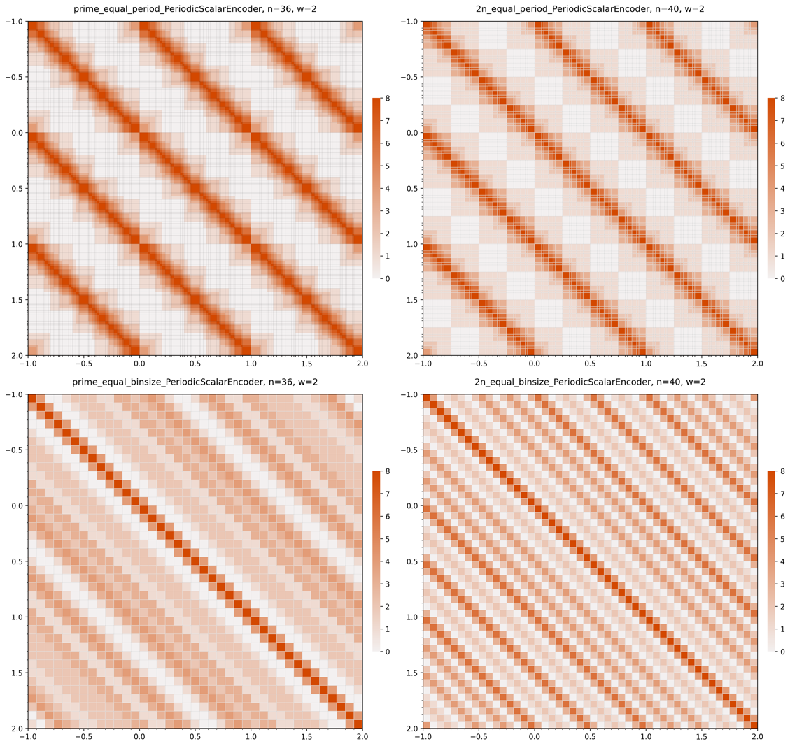
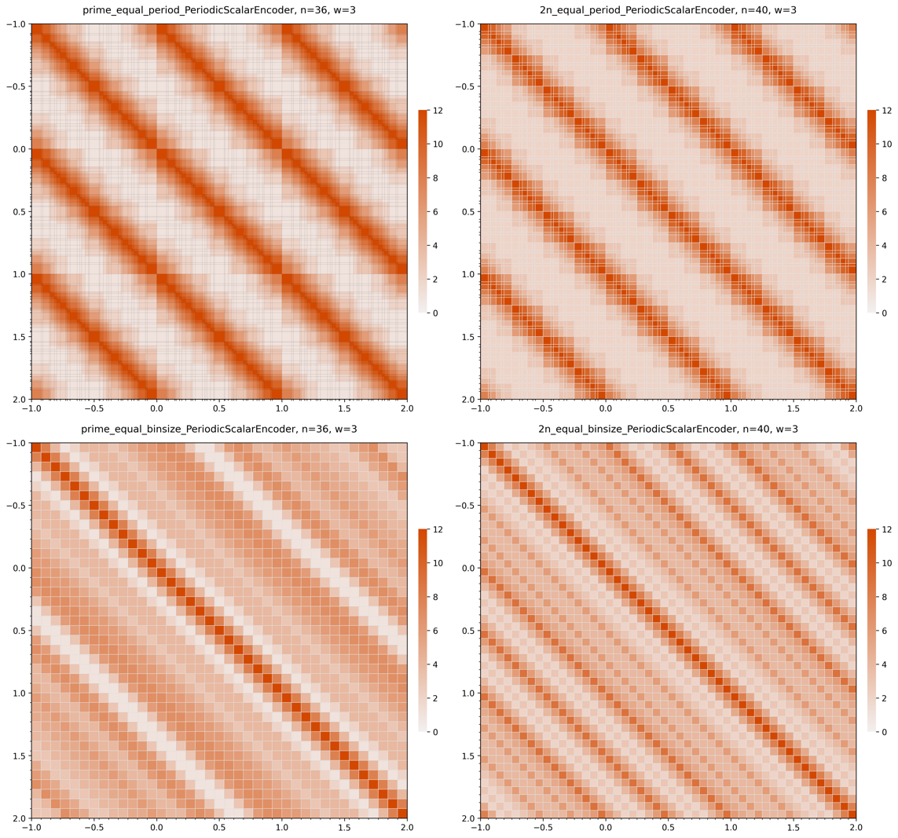

# Periodic Scalar Encoder — Style v3

Feature plots and similarity heatmaps for three bin-width variants. Third rendering style iteration.

| | w=1 | w=2 | w=3 |
|---|---|---|---|
| **Features** |  |  |  |
| **Similarity Heatmap** |  |  |  |
