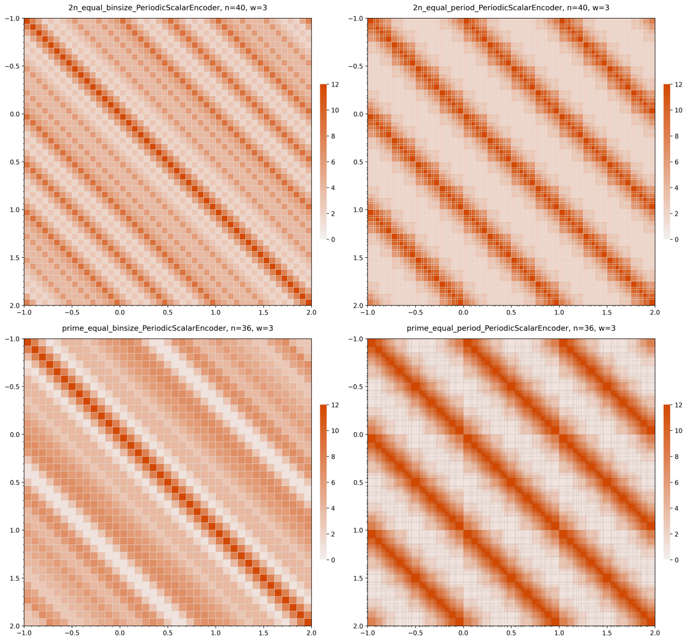
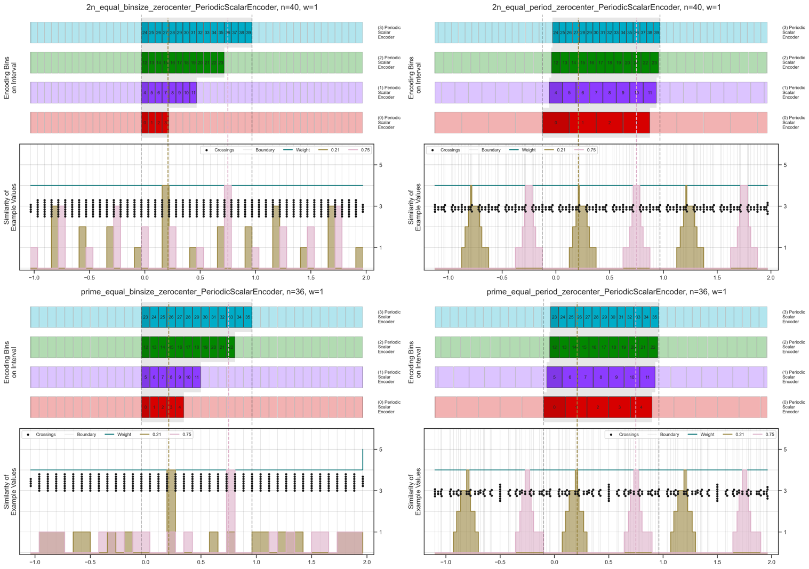
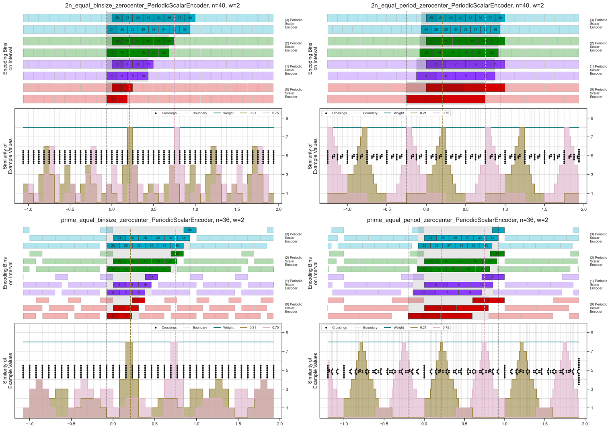
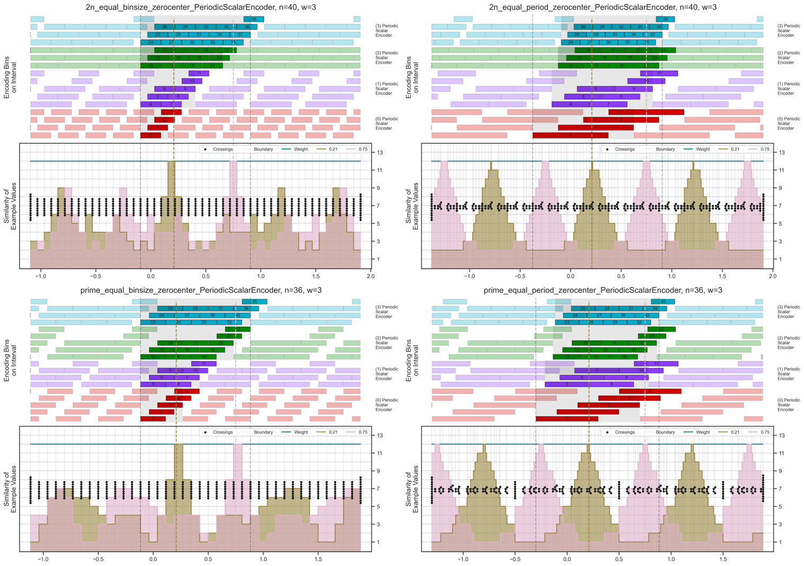
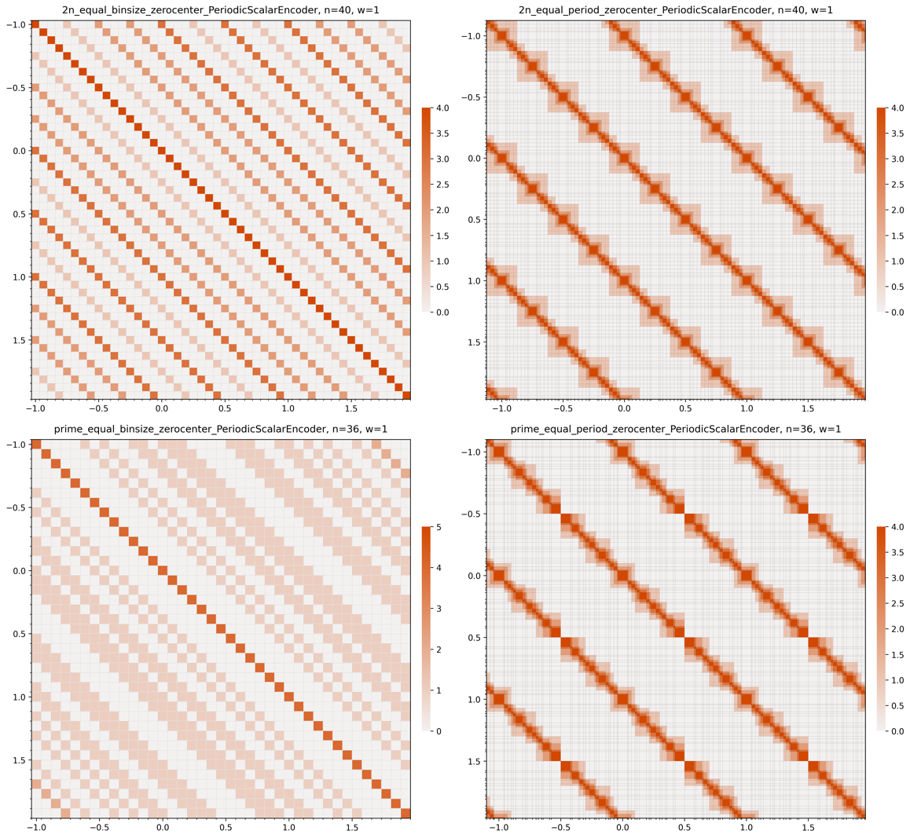
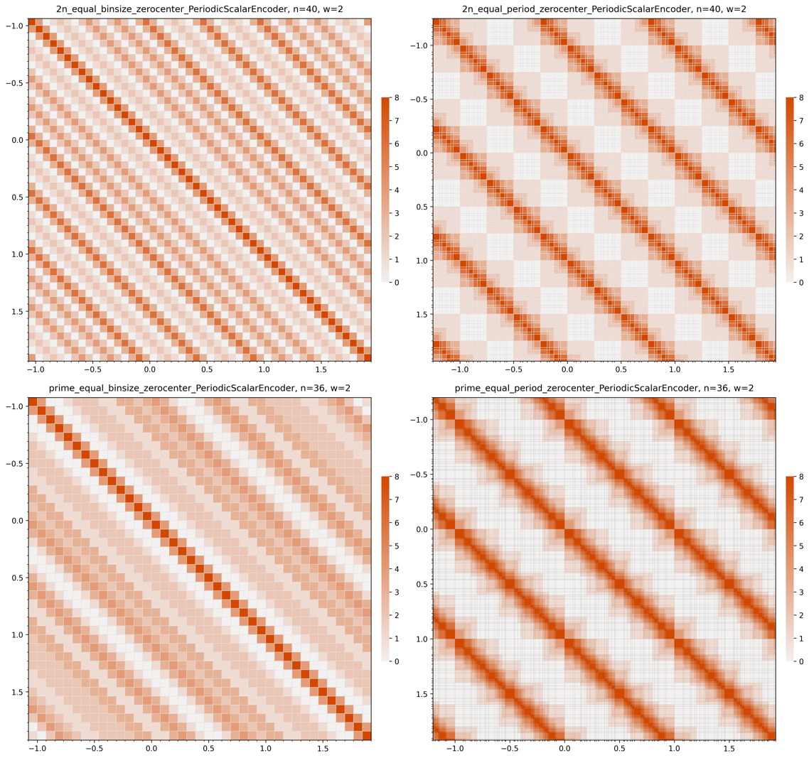
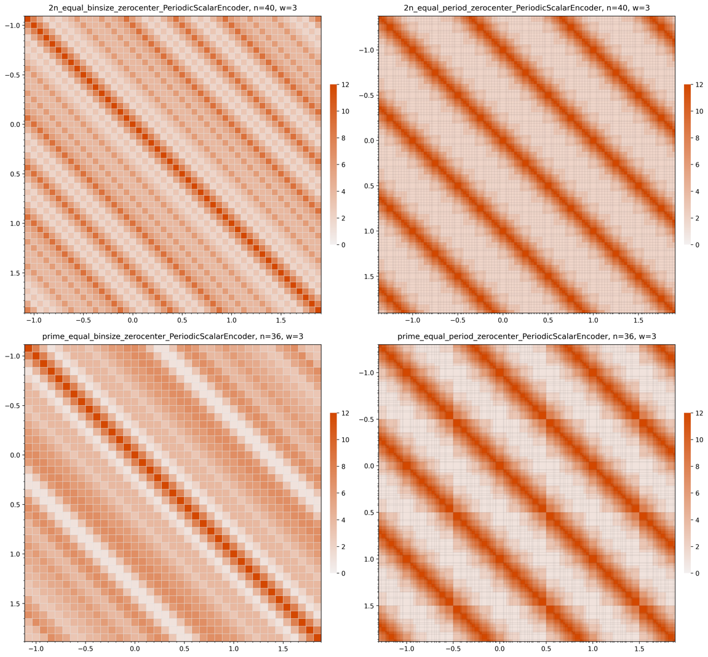

# Periodic Scalar Encoder — Style v4

Compact layout introduced in v4. Adds zero-offset variants alongside standard encoders.

## Standard (non-zero-offset)

| | w=1 | w=2 | w=3 |
|---|---|---|---|
| **Features (compact)** |  |  |  |
| **Heatmap** |  |  |  |

## Zero-offset Variants

| | w=1 | w=2 | w=3 |
|---|---|---|---|
| **Features (compact, zero)** |  |  |  |
| **Heatmap (zero)** |  |  |  |
