# Periodic Scalar Encoder — Style v6

Most polished rendering style. Adds explicit zero-aligned and zero-centered comparison renders for w=3.

## Standard (non-zero-offset)

| | w=1 | w=2 | w=3 |
|---|---|---|---|
| **Features (compact)** | 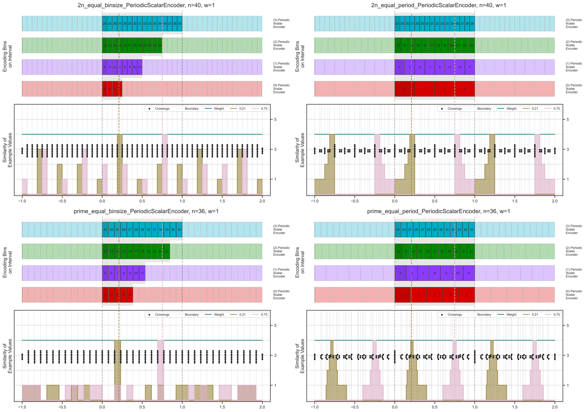 | 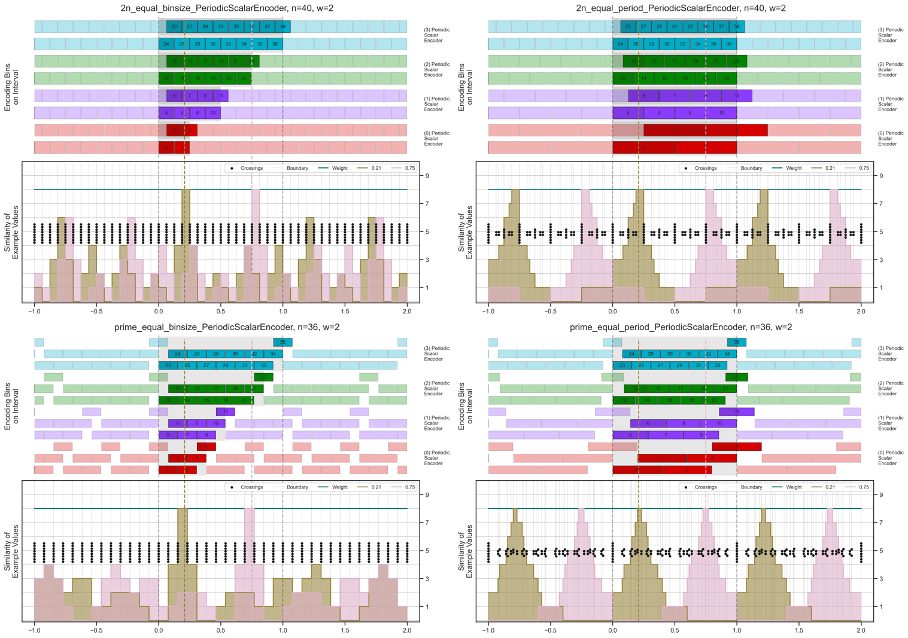 |  |
| **Heatmap** | 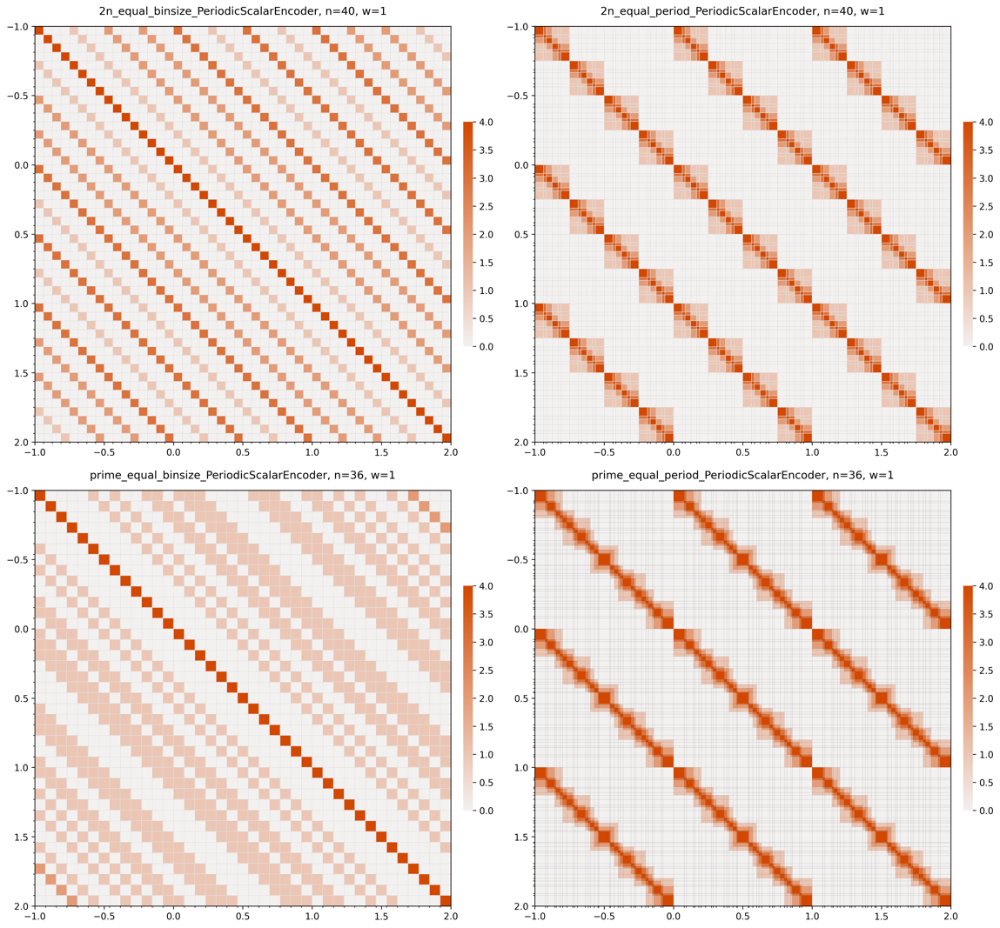 |  |  |

## Zero-offset Variants

| | w=1 | w=2 | w=3 |
|---|---|---|---|
| **Features (compact, zero)** | 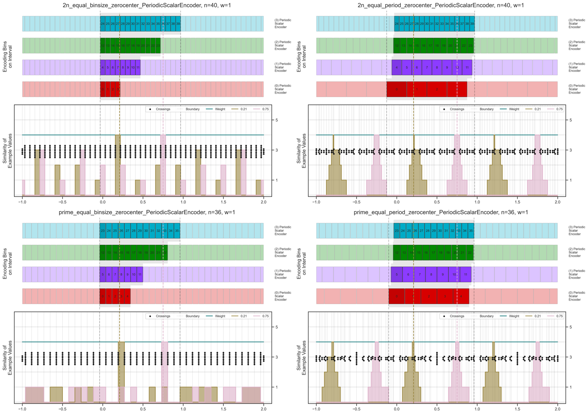 | 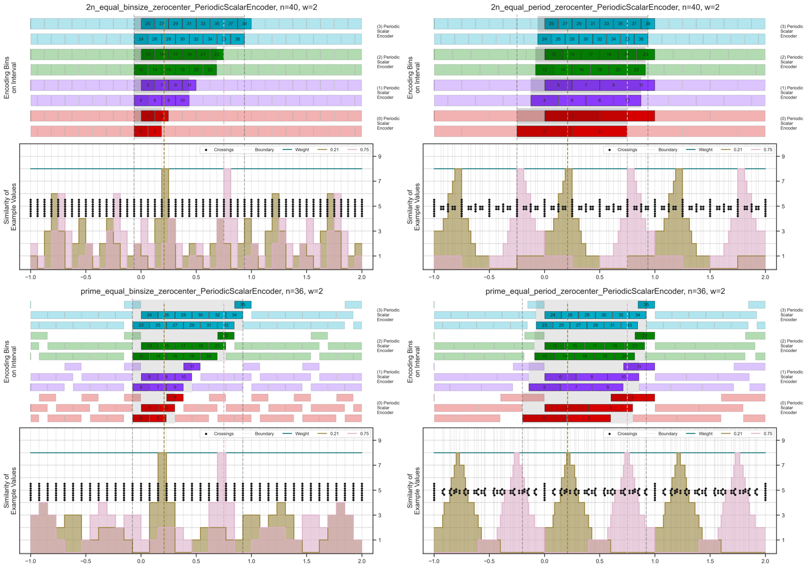 | 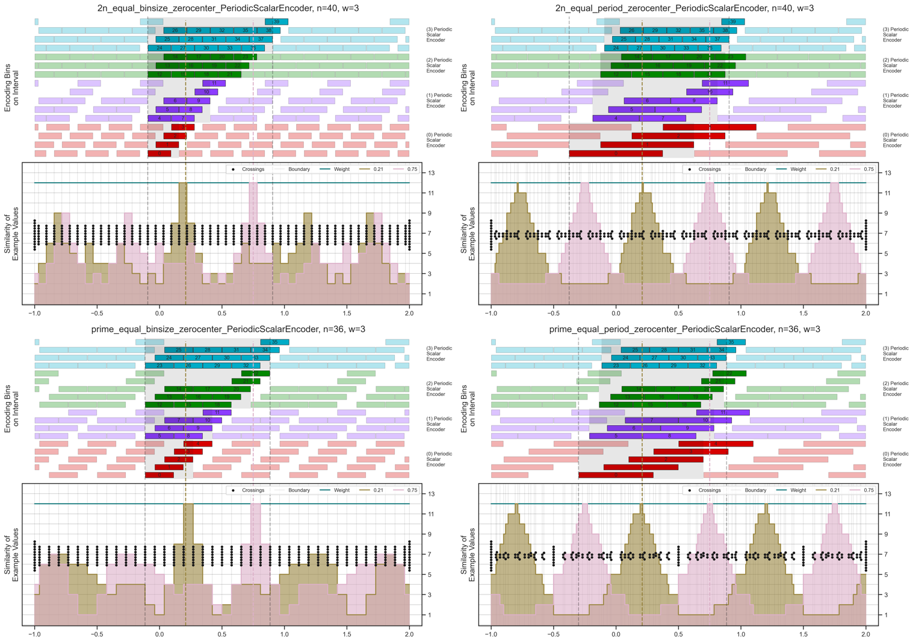 |
| **Heatmap (zero)** | 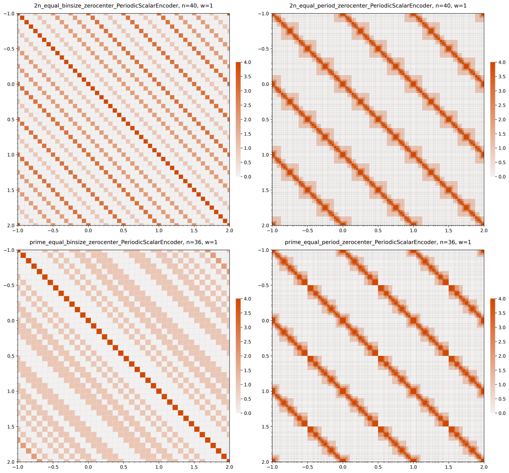 | 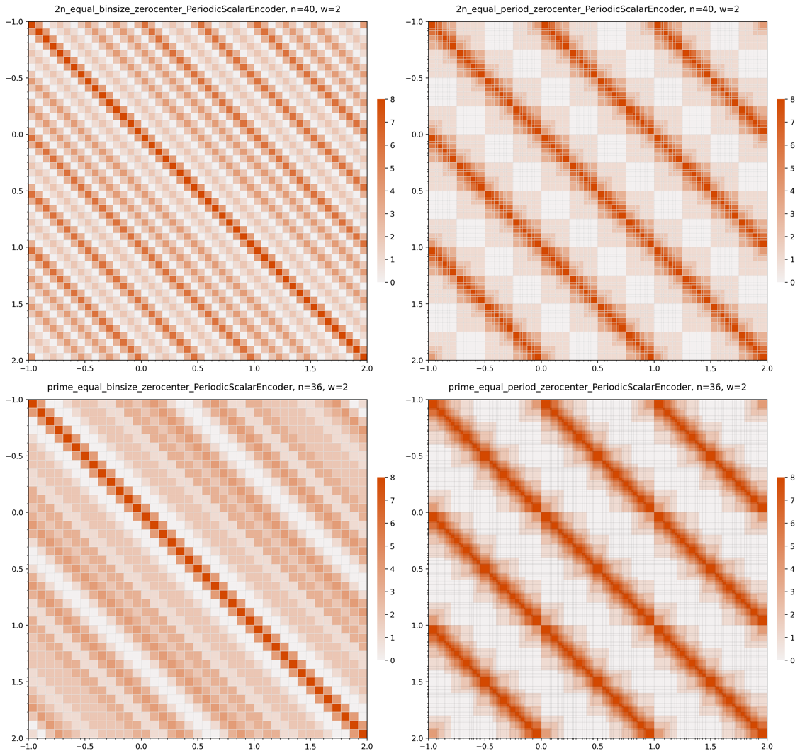 | 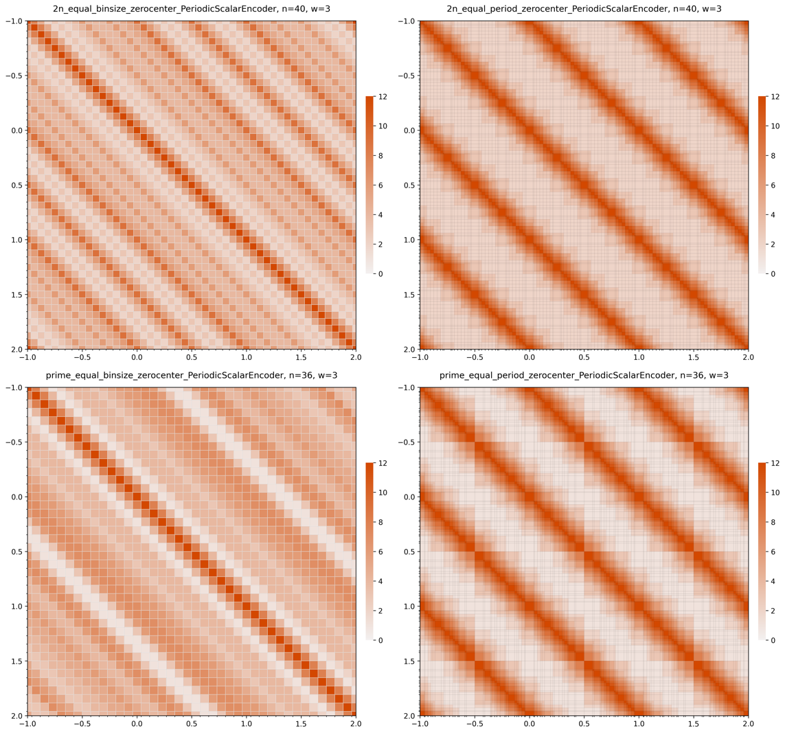 |

## Zero Alignment Comparison (w=3)

| Zero-aligned | Zero-centered |
|---|---|
| 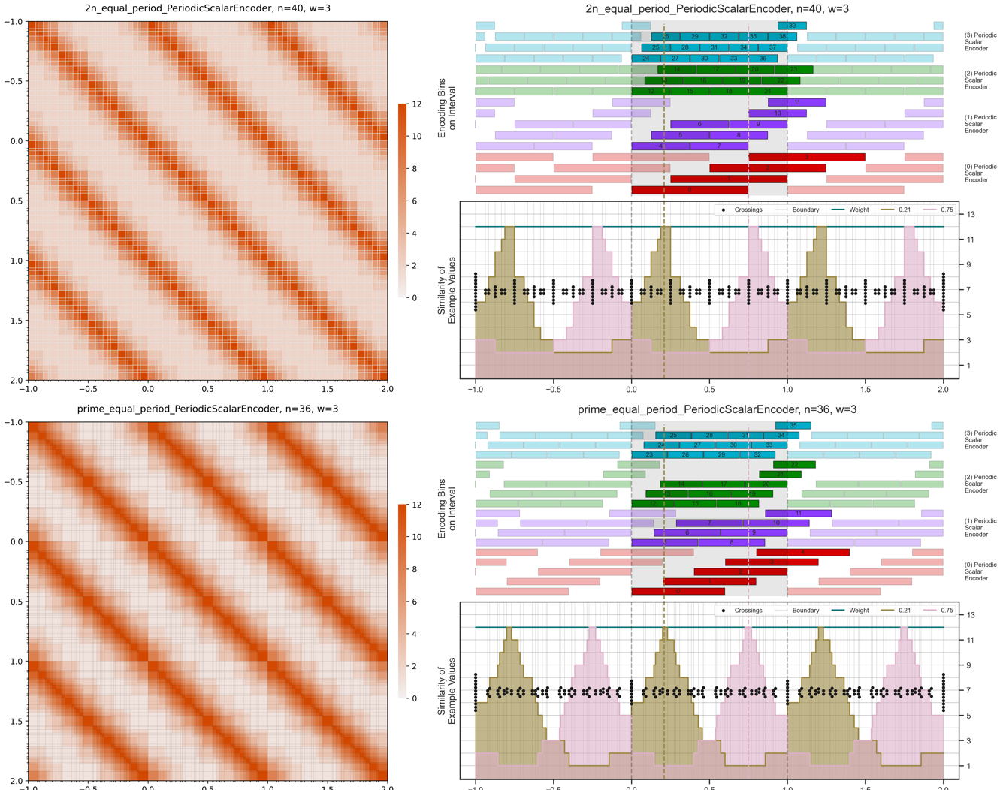 | 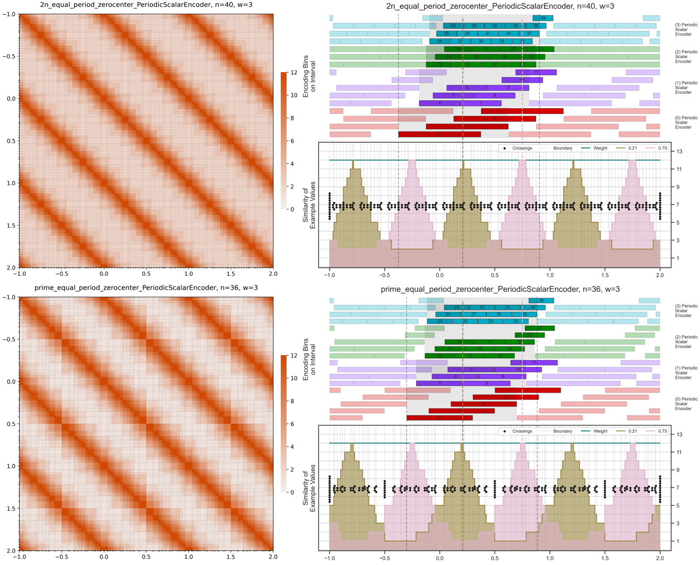 |
