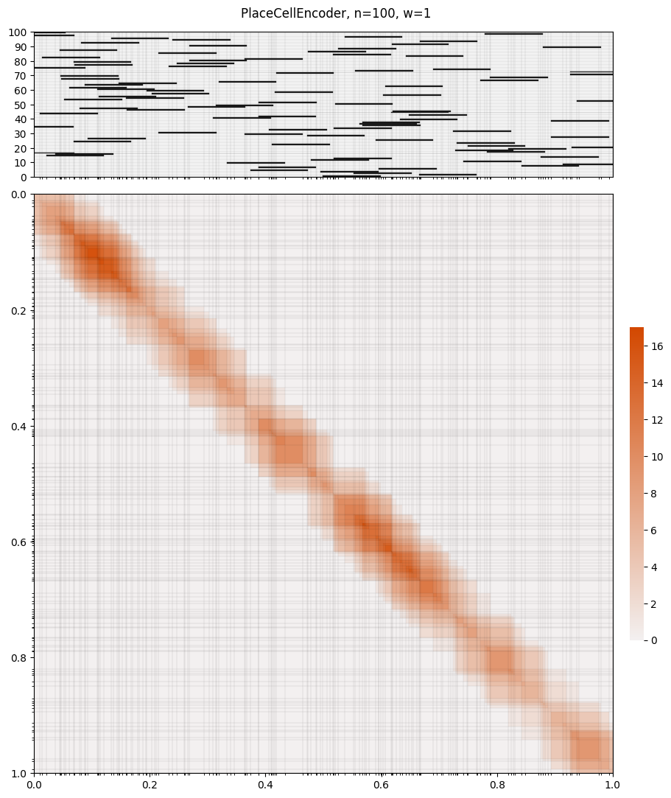
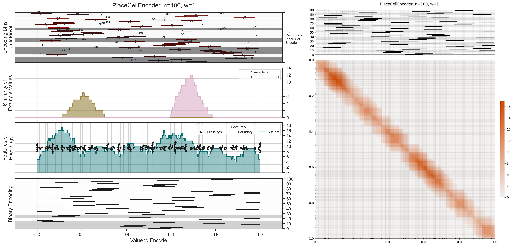

# Place Cell Encoder Examples

Feature plots and similarity matrices for the place cell encoder at n=100 bins.

## PlaceCellEncoder — n=100, w=1

### Feature Plot

### Similarity Matrix (Projected to Real Space)

---

## Alternative Render

