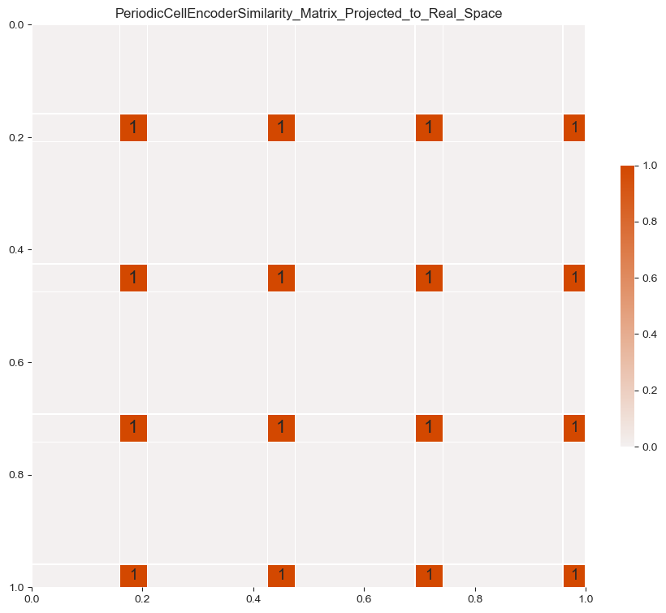
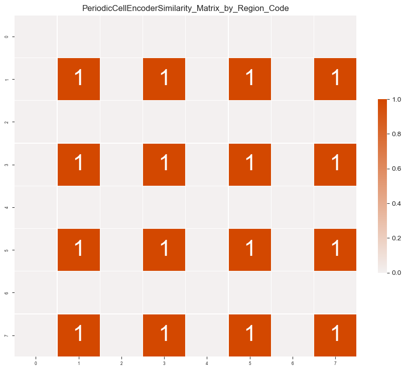
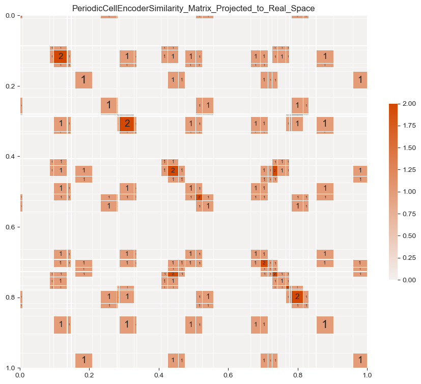
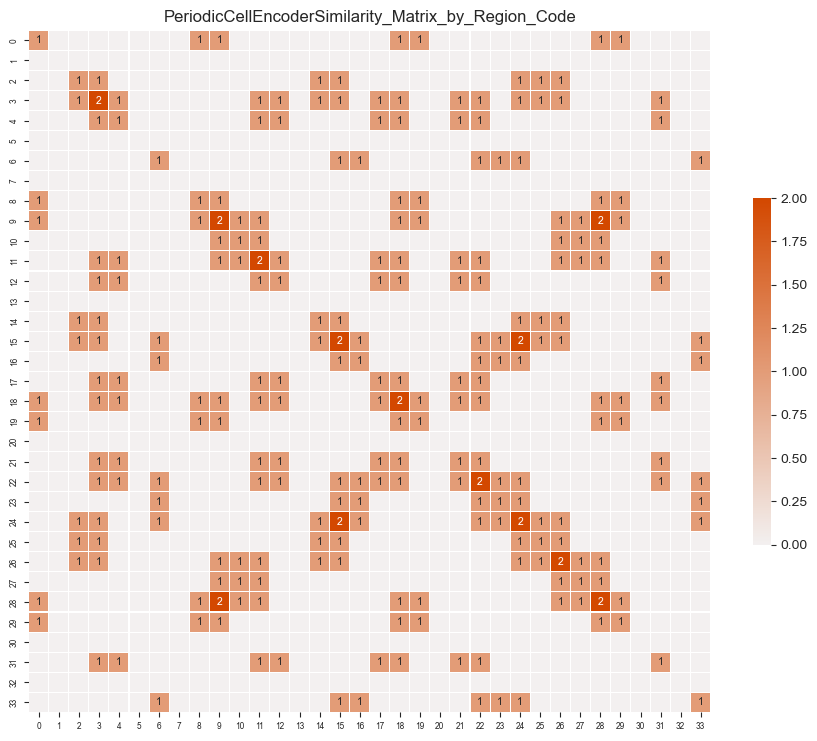

# Similarity Matrices — Sequential Palette (Omit Zero Text)

Same sequential colormap as the `sequential_pallette_similarity_matrix` collection, but with cell text labels suppressed for zero-valued cells to reduce visual clutter. 80 images.

**Views:**
- `Projected_to_Real_Space` — matrix axes ordered by input value
- `by_Region_Code` — matrix axes grouped by region identity

---

## Representative Samples

### n=1 (w=8)
| Projected to Real Space | By Region Code |
|---|---|
|  |  |

### n=5 (w=34)
| Projected to Real Space | By Region Code |
|---|---|
|  |  |

### n=10
| Projected to Real Space | By Region Code |
|---|---|
|  |  |
