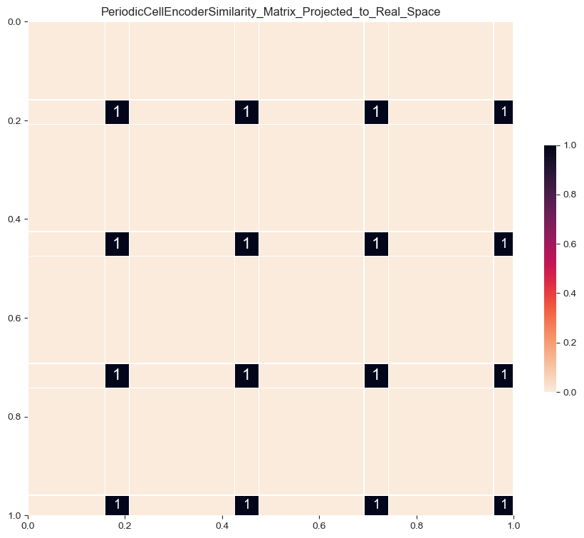
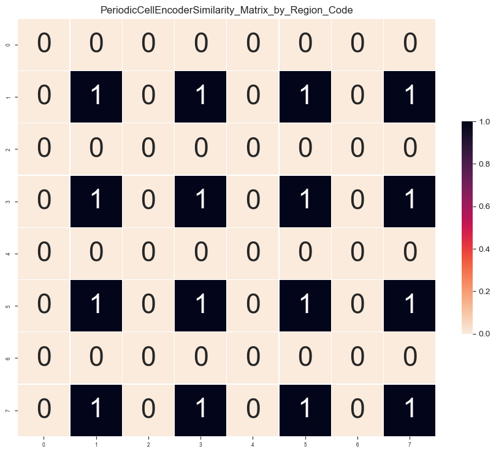
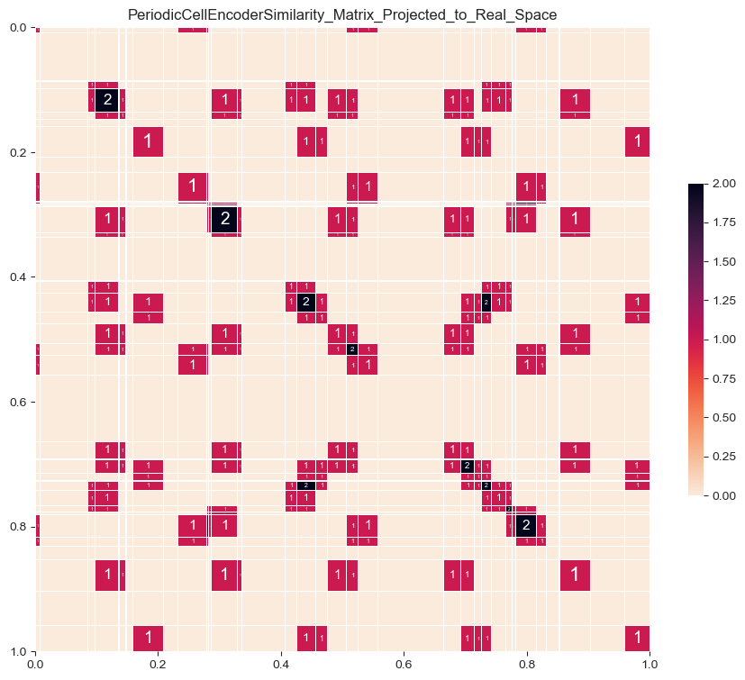
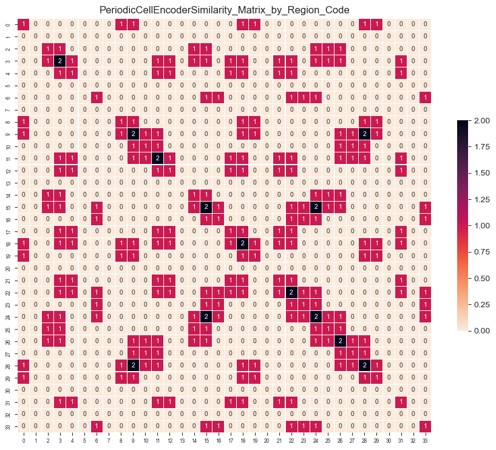

# Similarity Matrices — Sequential Palette

PeriodicCellEncoder similarity matrices rendered with a sequential colormap (shows magnitude of similarity). 80 images covering n=1–17 at varying `w`, each in two views.

**Views:**
- `Projected_to_Real_Space` — matrix axes ordered by input value
- `by_Region_Code` — matrix axes grouped by region identity

---

## Representative Samples

### n=1 (w=8)
| Projected to Real Space | By Region Code |
|---|---|
|  |  |

### n=5 (w=34)
| Projected to Real Space | By Region Code |
|---|---|
|  |  |

### n=10
| Projected to Real Space | By Region Code |
|---|---|
|  |  |

### n=16 (w=14)
| Projected to Real Space |
|---|
|  |
