# Time Series and State Vector Examples

Visualizations of temporal sequences and binary state vectors, from BrainBlocks and Sparsey integration experiments.

---

## Binary State Vectors

<table>
<tr>
  <td align="center">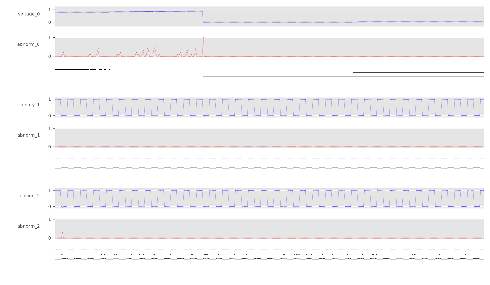 <b>binary_states2</b> Binary state vector sequence over time</td>
  <td align="center">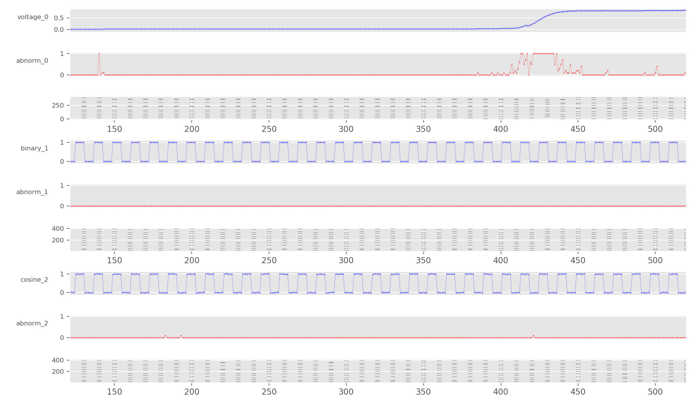 <b>state_vec_1</b> State vector snapshot — step 1</td>
  <td align="center">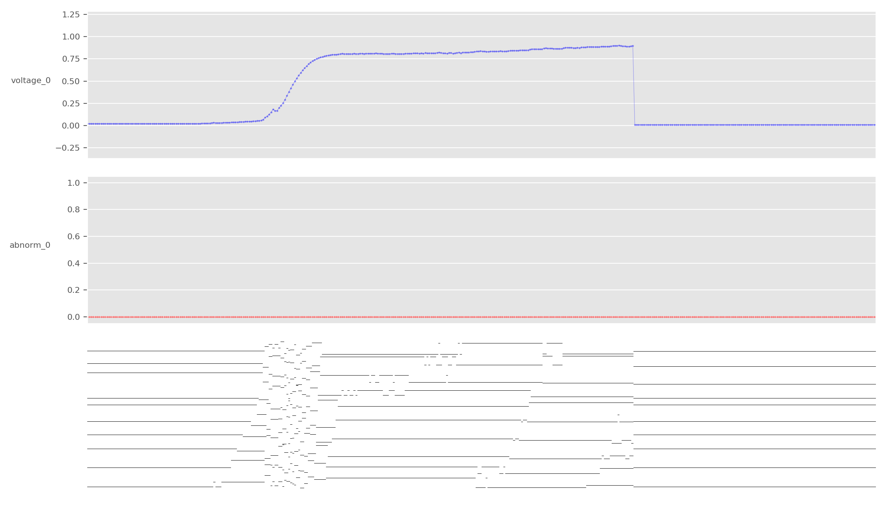 <b>state_vec_2</b> State vector snapshot — step 2</td>
</tr>
<tr>
  <td align="center">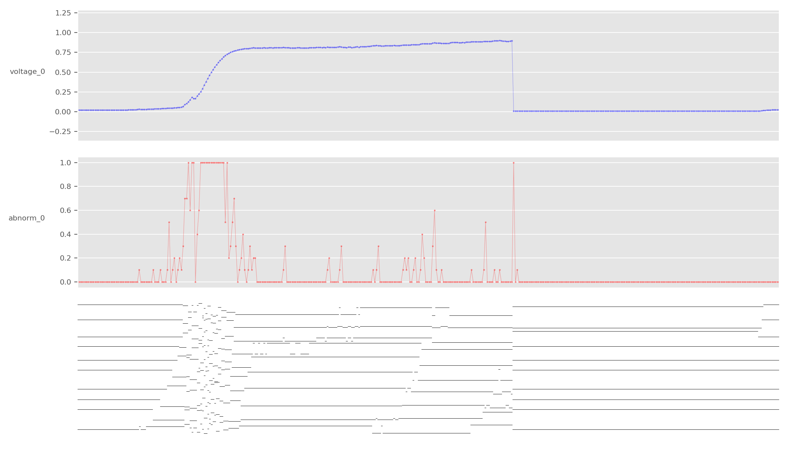 <b>state_vec_3</b></td>
  <td align="center">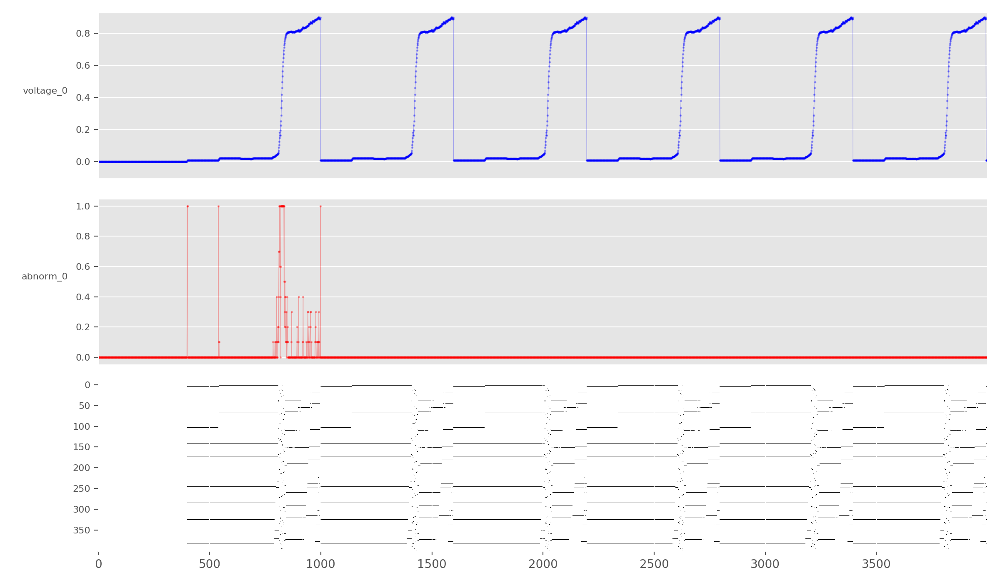 <b>state_vec_4</b></td>
  <td align="center">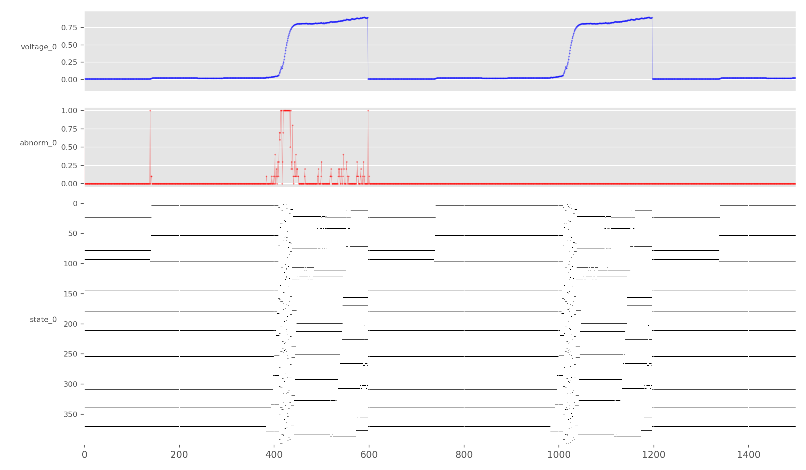 <b>state_vec_5</b></td>
</tr>
</table>

---

## Learning Dynamics

<table>
<tr>
  <td align="center">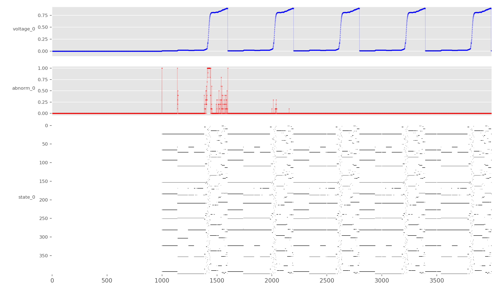 <b>states_vec_learning_distributed_init_1</b> State vector learning with distributed initialization — iteration 1</td>
  <td align="center">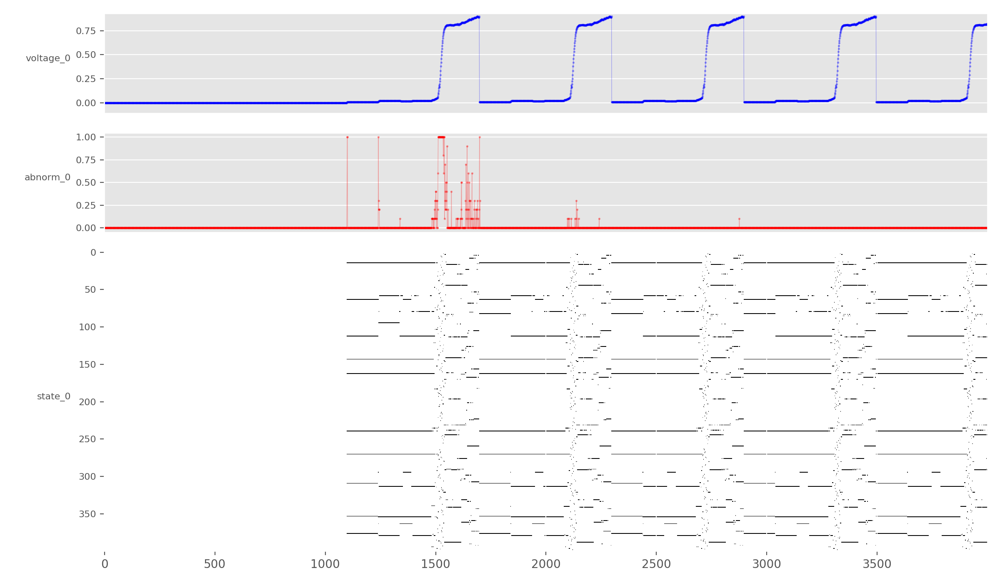 <b>states_vec_learning_distributed_init_2</b> State vector learning — iteration 2</td>
</tr>
</table>

---

## Anomaly Detection

<table>
<tr>
  <td align="center">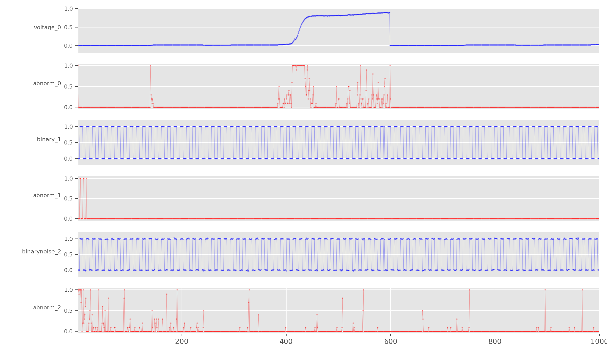 <b>Distributed failure</b> Square wave with distributed abnormality detection failure</td>
  <td align="center">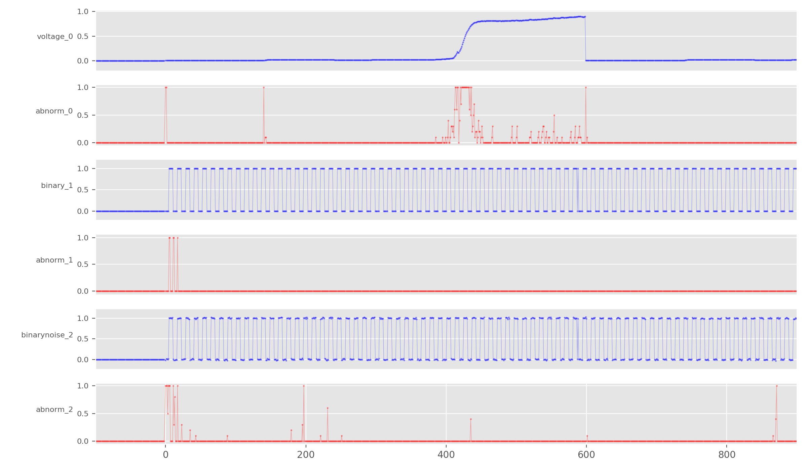 <b>Structured failure</b> Square wave with structured abnormality detection failure</td>
</tr>
</table>

---

## System Evaluations

<table>
<tr>
  <td align="center">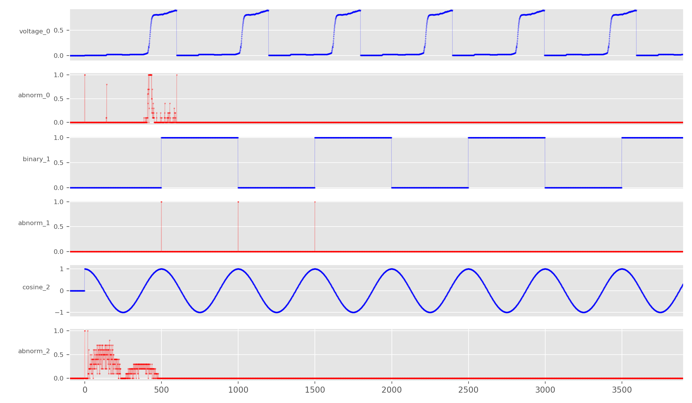 <b>brainblocks_nominal_eval_1</b> BrainBlocks nominal evaluation result</td>
  <td align="center">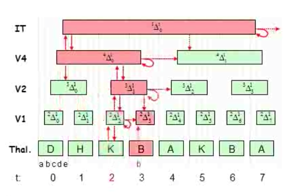 <b>sparsey_progressive_persistence</b> Sparsey progressive persistence visualization</td>
</tr>
</table>
